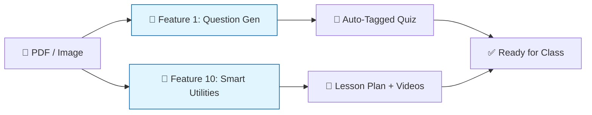
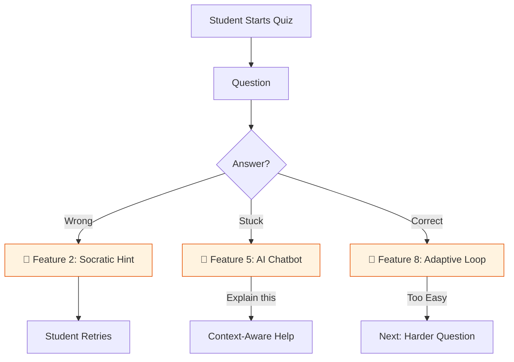
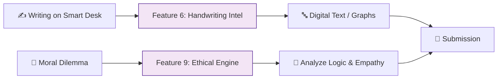
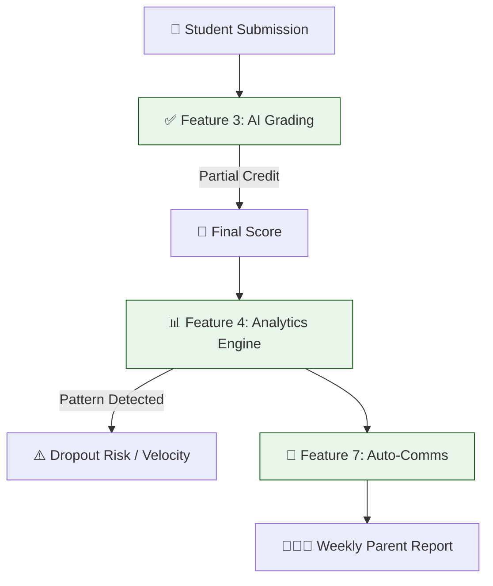

## License

Copyright © 2026 [Your Name]. All rights reserved. 

This project and its code are proprietary. Unauthorized copying, modification, 
or distribution of this file via any medium is strictly prohibited.


# Feature Desk G - Complete Documentation

## 1. Project Overview

## 🎯 WHAT IS FEATURE DESK?

A revolutionary smart study desk with:

* ✅ **Flip-top surface** (Normal desk ↔ Digital touchscreen)
* ✅ **Pressure-sensitive stylus pen** for natural writing
* ✅ **Integrated AI-powered educational platform** (10 core AI capabilities)
* ✅ **Integrated Analytics Dashboard** (Student + Teacher + School)
* ✅ **Virtual Labs** (Chemistry, Physics, Biology)

## 🏆 SUMMARY: WHY FEATURE DESK IS UNIQUE

**NO DIRECT COMPETITOR EXISTS** for Feature Desk's combination of:

| Unique Selling Point                       | Description                                                                                 |
| :----------------------------------------- | :------------------------------------------------------------------------------------------ |
| 🪑**Flip-Top Smart Desk**            | First desk that transforms from normal surface to digital touchscreen                       |
| ✍️**Natural Writing Experience**   | Stylus pen with pressure sensitivity on desk surface                                        |
| 🧠**10 Core AI Capabilities**        | Gemini-powered adaptive learning, grading, and analytics                                    |
| 🏫**Complete Educational Ecosystem** | Student + Teacher + School Admin/Analytics in one platform                                  |
| 🔬**Virtual Labs**                   | 50 interactive PhET simulations across Physics/Chemistry/Biology with 3D Three.js interface |
| 💰**Affordable AI**                  | AI token costs as low as ₹50-100/month for 1,000 students (see full TCO in §7.4)          |
| 🇮🇳**India-First Design**           | Built for CBSE/ICSE/State Board K-12 curriculum                                             |

---

## 2. System Architecture

### 2.1 Technology Stack

* **Frontend**: React (v18.3), TypeScript (v5.5), Vite (v7.3)
* **Styling**: Tailwind CSS (v3.4), Lucide React (v0.344, Icons), Framer Motion (v12.23)
* **AI Integration (Dual-Brain Strategy)**:
  * **Gemini 2.5 Flash**: Primary model for complex reasoning, content generation, grading, and multimodal analysis (~$0.50/month per 1000 students).
  * **Gemini 2.5 Flash Lite**: Cost-efficient model for high-frequency tasks like auto-naming, text extraction, and micro-analytics (~$0.10/month per 1000 students).
  * **API Key Fallback System**: Multiple Gemini API keys configured with automatic rotation on rate-limit errors (`gemini.ts`). If one key is exhausted, the system seamlessly falls back to the next key.
* **Databases (Triple-Layer Architecture)**:
  * **Supabase (PostgreSQL)**: *Structured Data & Relations*. Source of Truth for Authentication, User Roles, Class Schedules, Results, Assessments, Question Banks, and Real-time Notifications. JSONB columns store complex question data.
  * **Firebase (Firestore)**: *Real-time Chat & Feedback Data*. Specialized for storing AI **Chatbot Sessions**, **Chat History**, and **Detailed Student Feedback** (question-wise breakdowns).
  * **Cloudinary (Cloud Media)**: *Media Files & Images*. Handles all file uploads — teacher PDFs/documents, exam answer sheet images, canvas JSON data, and profile images via unsigned upload preset.
* **PDF Processing**: `pdfjs-dist` (v5.4) for client-side PDF text extraction
* **Charts & Visualization**: Recharts (v3.2) for analytics dashboards
* **Export**: html2canvas (v1.4) + jsPDF (v4.1) for PDF generation
* **Spreadsheet**: xlsx (v0.18) for batch question import (CSV/Excel parsing)
* **3D**: Three.js (v0.160) + React Three Fiber for Virtual Labs
* **State Management**: React Context API
* **Deployment**: Netlify (with `netlify.toml` configuration)

### 2.2 Database Roles Detailed

* **Supabase (PostgreSQL)**: Handles relational integrity (Student → Class → Subject). Real-time subscriptions power the live collaboration and notification features. JSONB columns store assessment questions and detailed quiz responses. Auto-calculated percentage fields in `quiz_results`. Row Level Security (RLS) policies on sensitive tables.
* **Firebase (Firestore)**: Handles AI chatbot conversation persistence and **Detailed Exam Feedback**. The `firestoreService.ts` manages:
  * **Chat**: `createChatSession()`, `saveChatMessage()`, `subscribeToChat()` for real-time study assistance.
  * **Feedback**: `saveStudentFeedback()` stores rich, JSON-heavy grade reports in the `student_feedback` collection, including question-wise marks, AI suggestions, and teacher comments that would otherwise bloat the SQL database.
* **Cloudinary**: Handles all media uploads via unsigned preset (`feature_desk_unsigned`). The `cloudinaryService.ts` auto-detects `resource_type` (image/raw/video/auto) based on MIME type. Supports `uploadFile()`, `uploadPdf()`, `uploadDocument()`, and `uploadJson()`. Used in exam submission (answer sheet images), canvas notes (JSON blobs), and teacher content uploads.

### 2.3 Database Implementation Matrix (Supabase + Firebase + Cloudinary)

| Feature / Module                    | Database Implementation | Implementation Details                                                           |
| :---------------------------------- | :---------------------- | :------------------------------------------------------------------------------- |
| **User Authentication**       | Supabase                | Secure login for Students (roll+password), Teachers (email+password), Admins     |
| **Student Profiles**          | Supabase                | `students` table with 20+ fields (roll, name, class, parent details, health)   |
| **Class/Subject Logic**       | Supabase                | `classes`, `subjects`, `class_subjects`, `student_subjects` tables       |
| **Assessments**               | Supabase                | `assessments` table with JSONB `questions` column, exam_type classification  |
| **Quiz Results & Grades**     | Supabase                | `quiz_results` table with auto-calculated `percentage` (GENERATED ALWAYS AS) |
| **Detailed Responses**        | Supabase                | `quiz_responses` table (per-question answers, marks, time_spent)               |
| **Question Banks**            | Supabase                | `study_materials` table with JSONB for AI-generated questions                  |
| **Chatbot Sessions**          | Firebase Firestore      | `chat_sessions` collection containing userId, title, lastMessageAt             |
| **Chat History**              | Firebase Firestore      | `chat_history` collection with session-aware message storage                   |
| **Detailed Feedback**         | Firebase Firestore      | `student_feedback` collection for question-wise grading breakdowns             |
| **File Uploads (PDF/Images)** | Cloudinary              | `cloudinaryService.uploadFile()` with auto resource_type detection             |
| **Exam Answer Sheets**        | Cloudinary + Supabase   | Images → Cloudinary, metadata/grades → Supabase `quiz_results`               |
| **Canvas Data (Strokes)**     | Cloudinary + Supabase   | JSON blobs → Cloudinary, metadata → Supabase `student_notes`                 |
| **Notifications**             | Supabase                | `notifications` table with Real-time subscriptions                             |
| **Attendance**                | Supabase                | `student_attendance` table with daily tracking                                 |
| **Leaderboard**               | Supabase                | `leaderboard` table with points, badges, streaks, levels                       |
| **Peer Help System**          | Supabase                | `peer_help_requests`, `peer_sessions`, `peer_messages` tables              |

### 2.4 Entity-Relationship (ER) Diagram

```
┌──────────────┐       ┌──────────────────┐       ┌──────────────┐
│   classes    │       │    subjects      │       │   teachers   │
│──────────────│       │──────────────────│       │──────────────│
│ PK id (INT)  │◄──┐   │ PK code (VARCHAR)│◄──┐   │ PK id (UUID) │
│ class_name   │   │   │ subject_name     │   │   │ email        │
│ section      │   │   │ icon_emoji       │   │   │ teacher_name │
│ academic_year│   │   │ color            │   │   │ is_class_tchr│
└──────────────┘   │   └──────────────────┘   │   │ FK assigned_ │
       ▲           │          ▲               │   │    class→cls │
       │           │          │               │   │ assigned_subj│
       │    ┌──────┴──────────┴────────┐      │   └──────────────┘
       │    │    class_subjects        │      │          ▲
       │    │──────────────────────────│      │          │
       │    │ PK id (UUID)             │      │          │
       │    │ FK class_id → classes    │──────┘          │
       │    │ FK subject_code → subj   │                 │
       │    │ FK teacher_id → teachers │─────────────────┘
       │    └──────────────────────────┘
       │
       │    ┌──────────────────────┐       ┌──────────────────────┐
       ├────│    students          │       │  student_subjects    │
       │    │──────────────────────│       │──────────────────────│
       │    │ PK id (UUID)         │◄──────│ FK student_id → stud │
       │    │ roll_number (UNIQUE) │       │ FK subject_code→subj │
       │    │ student_name         │       └──────────────────────┘
       │    │ FK current_class→cls │
       │    │ FK current_subj→subj │
       │    │ password, gender     │
       │    │ parent_name/phone    │
       │    └──────────┬───────────┘
       │               │ (student_id FK used by all below)
       │               │
       │    ┌──────────┼──────────┬──────────────┬──────────────┐
       │    ▼          ▼          ▼              ▼              ▼
  ┌─────────────┐ ┌─────────┐ ┌───────────┐ ┌──────────┐ ┌──────────────┐
  │quiz_results │ │student_ │ │student_   │ │leaderboard││peer_help_    │
  │─────────────│ │notes    │ │attendance │ │──────────│ │requests      │
  │FK student_id│ │─────────│ │───────────│ │FK stud_id│ │──────────────│
  │FK assess_id │ │FK stud  │ │FK stud_id │ │FK class  │ │FK requester  │
  │score, grade │ │title    │ │date,status│ │FK subject│ │FK helper     │
  │percentage   │ │content  │ │FK marked_ │ │points    │ │topic, status │
  │(GENERATED)  │ │FK subj  │ │  by→tchr  │ │badges    │ │urgency       │
  │ai_suggested │ │note_type│ └───────────┘ │rank,level│ └──────┬───────┘
  │teacher_appr │ │tags     │               └──────────┘        │
  └──────┬──────┘ └─────────┘                                   ▼
         │                                              ┌──────────────┐
         ▼                                              │peer_sessions │
  ┌──────────────┐                                      │──────────────│
  │quiz_responses│    ┌──────────────────┐              │FK request_id │
  │──────────────│    │  notifications   │              │rating,feedbk │
  │FK result_id  │    │──────────────────│              └──────┬───────┘
  │question_id   │    │FK sender→teacher │                     │
  │student_answer│    │FK class_id→cls   │                     ▼
  │is_correct    │    │title, message    │              ┌──────────────┐
  │marks_obtained│    │type, priority    │              │peer_messages │
  └──────────────┘    └──────────────────┘              │──────────────│
                                                        │FK session_id │
  ┌──────────────────┐   ┌──────────────────────┐       │FK sender_id  │
  │ study_materials  │   │ student_interactions │       │content, type │
  │──────────────────│   │──────────────────────│       └──────────────┘
  │FK subject→subj   │   │FK student_id → stud  │
  │FK class→cls      │   │FK subject→subj       │
  │FK uploaded_by→tc │   │interaction_type      │
  │file_url, ai_sum  │   │details (JSONB)       │
  │key_topics, tags  │   │duration              │
  └──────────────────┘   └──────────────────────┘

  ┌──────────────────────────────────────────────────────┐
  │                  assessments                         │
  │──────────────────────────────────────────────────────│
  │ PK id (UUID)                                          │
  │ FK subject_code → subjects                            │
  │ FK class_id → classes                                 │
  │ FK created_by → teachers                              │
  │ title, exam_type, questions (JSONB), total_marks      │
  │ time_limit, passing_marks, shuffle_questions          │
  │ instructions, scheduled_at, is_active                 │
  └──────────────────────────────────────────────────────┘
```

**Key Relationships:**

- `classes` ← `students` (many students per class)
- `subjects` ← `assessments`, `student_notes`, `leaderboard` (many records per subject)
- `teachers` → `assessments` (created_by), `notifications` (sender), `study_materials` (uploaded_by)
- `students` → `quiz_results`, `student_notes`, `student_attendance`, `leaderboard`, `peer_help_requests`
- `quiz_results` → `quiz_responses` (detailed per-question breakdown)
- `peer_help_requests` → `peer_sessions` → `peer_messages` (chat chain)

---

### 2.5 Triple-Layer Data Flow Diagram

```
┌─────────────────────────────────────────────────────────────────────────┐
│                           REACT FRONTEND                                 │
│  (Components: StudentDashboard, TeacherDashboard, SchoolDashboard)      │
└──────────┬──────────────────────┬───────────────────────┬───────────────┘
           │                      │                       │
           │ Structured Data      │ Chat & Feedback        │ Media Files
           │ (CRUD + Real-time)   │ (NoSQL JSON)           │ (Upload/Download)
           ▼                      ▼                        ▼
┌──────────────────┐   ┌──────────────────┐   ┌──────────────────────────┐
│  SUPABASE        │   │  FIREBASE        │   │  CLOUDINARY              │
│  (PostgreSQL)    │   │  (Firestore)     │   │  (Cloud Media)           │
│──────────────────│   │──────────────────│   │──────────────────────────│
│                  │   │                  │   │                          │
│ • Students       │   │ • chat_sessions  │   │ • Exam answer sheets     │
│ • Teachers       │   │ • chat_history   │   │   (image/auto)           │
│ • Classes/Subj   │   │ • student_feedbk │   │ • Teacher PDFs           │
│ • Assessments    │   │                  │   │   (raw)                  │
│ • Quiz Results   │   │ subscriptions    │   │ • Canvas JSON data       │
│ • Quiz Responses │   │ for AI chatbot   │   │   (raw/json)             │
│ • Notifications  │   │                  │   │ • Documents (Word/Excel) │
│ • Attendance     │   │                  │   │   (raw)                  │
│ • Leaderboard    │   │                  │   │                          │
│ • Peer System    │   │                  │   │ Upload Preset:           │
│ • Study Mats     │   │                  │   │ feature_desk_unsigned    │
│ • Interactions   │   │                  │   │                          │
│                  │   │                  │   │ Auto resource_type:      │
│ RLS Policies ✓   │   │                  │   │ image→auto, pdf→raw      │
│ Real-time ✓      │   │                  │   │ doc→raw, json→raw        │
│ JSONB Columns ✓  │   │                  │   │                          │
└──────────────────┘   └──────────────────┘   └──────────────────────────┘

     Service Files:          Service File:           Service File:
     supabase.ts             firebaseService.ts      cloudinaryService.ts
     teacherDb.ts            firebase.ts
     schoolDb.ts
     questionDb.ts
     db.ts (hybrid helper)
```

---

### 2.6 Authentication Flow Diagram

```
                    ┌──────────────────┐
                    │   Login Screen   │
                    │   (Login.tsx)    │
                    └────────┬─────────┘
                             │
                    ┌────────┴─────────┐
                    │  Select User Type │
                    │  Student/Teacher/ │
                    │  School Admin     │
                    └────────┬─────────┘
                             │
            ┌────────────────┼────────────────┐
            ▼                ▼                ▼
   ┌──────────────┐  ┌──────────────┐  ┌──────────────┐
   │   Student    │  │   Teacher    │  │  School Admin│
   │──────────────│  │──────────────│  │──────────────│
   │Roll: 7A001   │  │Email: teacher│  │Email: admin  │
   │Pass: 123456  │  │  @demo.com   │  │  @school.edu │
   │              │  │Pass: teacher │  │Pass: admin123│
   │              │  │  123         │  │              │
   └──────┬───────┘  └──────┬───────┘  └──────┬───────┘
          │                 │                 │
          ▼                 ▼                 │
   ┌──────────────┐  ┌──────────────┐         │
   │ClassSubject  │  │ClassSubject  │         │
   │Selector      │  │Selector      │         │
   │(if no class/ │  │(if not class │         │
   │subject set)  │  │teacher & no  │         │
   │              │  │subjects)     │         │
   └──────┬───────┘  └──────┬───────┘         │
          │                 │                 │
          ▼                 ▼                 ▼
   ┌──────────────┐  ┌──────────────┐  ┌──────────────┐
   │ Student      │  │ Teacher      │  │ School       │
   │ Dashboard    │  │ Dashboard    │  │ Dashboard    │
   │ + Canvas     │  │ + Modules    │  │ + Analytics  │
   │ + CentralHub │  │ + AI Chatbot │  │ + Management │
   │ + AI Chatbot │  │              │  │              │
   └──────────────┘  └──────────────┘  └──────────────┘
```

---

### 2.7 AI Content Pipeline Flow Diagram

```
┌──────────────────────────────────────────────────────────────────┐
│                      TEACHER PORTAL                              │
│                                                                  │
│  ┌─────────────────┐                                             │
│  │ Upload Material  │  PDF / Image / Text Notes                  │
│  │ (StudyMaterials  │─────────────────────────┐                  │
│  │  Manager.tsx)    │                         │                  │
│  └─────────────────┘                          ▼                  │ 
│                                    ┌──────────────────────┐      │
│                                    │ extractTextFromPDF() │      │
│                                    │ (pdfjs-dist v5.4)    │      │
│                                    └──────────┬───────────┘      │
│                                               │                  │
│                                               ▼                  │
│                                    ┌──────────────────────┐      │
│                                    │ processAndGenerate   │      │
│                                    │ Content()            │      │
│                                    │ (contentAI.ts)       │      │
│                                    └──────────┬───────────┘      │
│                                               │                  │
│                         ┌─────────────────────┼───────────┐      │
│                         ▼                     ▼           ▼      │
│              ┌────────────────┐  ┌──────────────┐ ┌──────────┐  │
│              │ generateQns    │  │ generateLrng │ │ save to  │  │
│              │ FromContent()  │  │ Method()     │ │ Supabase │  │
│              │ (Gemini Flash) │  │ (Gemini Flash│ │ teaching │  │
│              │                │  │              │ │ materials│  │
│              │ → MCQ          │  │ → Summary    │ │ table    │  │
│              │ → Short Answer │  │ → Key Points │ └──────────┘  │
│              │ → Long Answer  │  │ → Study Tips │               │
│              │ → Bloom's Level│  │ → Exercises  │               │
│              └───────┬────────┘  └──────┬───────┘               │
│                      │                  │                        │
│                      ▼                  ▼                        │
│           ┌──────────────────────────────────────┐               │
│           │ saveGeneratedQuestions() → Supabase  │               │
│           │ saveLearningMethod()    → Supabase   │               │
│           │ (questionDb.ts)                      │               │
│           └──────────────────┬───────────────────┘               │
│                              │                                   │
└──────────────────────────────┼───────────────────────────────────┘
                               │
                               ▼  Supabase (question_banks, learning_methods)
┌──────────────────────────────┴───────────────────────────────────┐
│                      STUDENT PORTAL                              │
│                                                                  │
│  ┌─────────────────┐     ┌──────────────────────────┐            │
│  │ QuizApp.tsx     │───► │ getRandomQuizQuestions() │            │
│  │ (Adaptive Quiz) │     │ → Filters by class/subj  │            │
│  │                 │     │ → Difficulty matching    │            │
│  │ TestApp.tsx     │     │ → Random selection       │            │
│  │ (Unit Tests)    │     └──────────────────────────┘            │
│  │                 │                                             │
│  │ ExaminationApp  │     ┌──────────────────────────┐            │
│  │ (Board Exams)   │───► │ gradeAnswerAgainst       │            │
│  └─────────────────┘     │ Content() → AI grading   │            │
│                          └──────────────────────────┘            │
└──────────────────────────────────────────────────────────────────┘
```

---

## 3. Feature Breakdown

---

### 3.1 Student Portal - Detailed Application Breakdown

#### 📱 **Core Interface Components**

##### **Writing Canvas** (`WritingCanvas.tsx` - 67KB)

A distraction-free, infinite digital notebook that serves as the primary workspace for students.

**Implementation Details:**

* **Canvas Technology**: HTML5 Canvas with custom stroke rendering
* **Pressure Simulation**: Velocity-based stroke width calculation for natural pen feel
* **Infinite Canvas**: Virtual scrolling with viewport-based rendering
* **Paper Styles**: Lined, grid, blank, and graph paper templates
* **Smart Toolbar**:
  * Pen types: Ballpoint, Fountain, Highlighter, Marker
  * Eraser modes: Stroke eraser, Point eraser, Area eraser
  * Color palette with recent colors
  * Undo/Redo with unlimited history
* **Storage**: All stroke data serialized to **Cloudinary** (JSON blobs) with metadata in **Supabase** for replay capability

##### **Central Hub** (`CentralHub.tsx` - 12KB)

A floating "Super Animation" button that expands to reveal 12 integrated applications.

**Implementation Details:**

* **Radial Menu**: 360° expansion with smooth elastic animation
* **Drag & Drop**: Hub can be repositioned anywhere on screen
* **App Cards**: Each app shows icon, name, description, and preview image
* **Navigation**: React Router integration for seamless app switching
* **Memory**: Saves last position in localStorage

---

#### 📚 **Student Applications**

| #  | App Name            | Component                       | Size | Primary Function                |
| -- | ------------------- | ------------------------------- | ---- | ------------------------------- |
| 1  | Quiz App            | `QuizApp.tsx`                 | 29KB | Adaptive daily practice         |
| 2  | Unit Test App       | `TestApp.tsx`                 | 20KB | Timed chapter assessments       |
| 3  | Examination App     | `ExaminationApp.tsx`          | 25KB | High-stakes board-style exams   |
| 4  | Dashboard Analysis  | `DashboardAnalysis.tsx`       | 15KB | Performance self-reflection     |
| 5  | Live Chatbot        | `LiveChatbot.tsx`             | 11KB | AI study companion              |
| 6  | Floating AI Chatbot | `FloatingAIChatbot.tsx`       | 21KB | Context-aware assistant         |
| 7  | Notes App           | `NotesApp.tsx`                | 14KB | Digital notebook with AI naming |
| 8  | History Viewer      | `HistoryViewer.tsx`           | 12KB | Activity timeline               |
| 9  | Notification Center | `NotificationCenter.tsx`      | 10KB | Teacher communications          |
| 10 | Life Activity App   | `LifeActivityApp.tsx`         | 11KB | Ethical reasoning scenarios     |
| 11 | Social Learning     | `SocialLearningDashboard.tsx` | 29KB | Peer collaboration              |
| 12 | Virtual Labs        | Route:`/virtual-labs`         | -    | Unity WebGL experiments         |

---

#### 🎯 **App 1: Quiz App (Adaptive Learning)**

**File**: `QuizApp.tsx` | **Size**: 29KB

**Purpose**: Daily practice with AI-powered adaptive difficulty adjustment.

**Key Features:**

* **Teacher Content Integration**: Pulls questions from teacher-uploaded PDFs
* **AI Fallback**: Generates questions via Gemini when no teacher content available
* **Socratic Hints**: Progressive hint system (Conceptual → Formula → Step-by-step)
* **Immediate Feedback**: Detailed explanations for every wrong answer
* **Adaptive Reinforcement**: Generates targeted follow-up questions for weak areas

**Implementation Flow:**

```
1. checkTeacherContent() → Verify if teacher uploaded materials
2. generateQuiz() → Pull from Supabase question bank
3. generateWithAI() → Fallback to Gemini API
4. handleAnswerSelect() → Record answer + response time
5. generateSocraticHints() → AI hint generation on wrong answers
6. handleNextQuestion() → Adapt difficulty based on performance
```

**Data Model:**

```typescript
interface QuizQuestion {
    id: number | string;
    question: string;
    options: string[];
    correct: number;
    explanation: string;
    timeEstimate: number;
    marks?: number;
    difficulty?: 'easy' | 'medium' | 'hard';
    sourceContentTitle?: string;  // Links to teacher's uploaded PDF
}
```

---

#### 📝 **App 2: Unit Test App (Chapter Assessments)**

**File**: `TestApp.tsx` | **Size**: 20KB

**Purpose**: Timed chapter-wise assessments with basic lockdown features.

**Key Features:**

* **Subject-wise Organization**: Tests grouped by Mathematics, Science, English, etc.
* **Search & Filter**: Find tests by subject or keywords
* **Timed Assessment**: Configurable duration per test (25-40 minutes typical)
* **Score History**: View completed test results
* **Question Navigation**: Jump to any question during the test

**Implementation Flow:**

```
1. Display available tests (mockTests data)
2. handleStartTest(test) → Initialize timer, lock navigation
3. handleSelectAnswer() → Store answers in local state
4. handleNextQuestion() → Navigate with boundary checks
5. calculateScore() → Compute final score on submission
```

**Test Structure:**

```typescript
interface Test {
    id: string;
    title: string;          // "Algebra Unit Test"
    subject: string;        // "Mathematics"
    duration: number;       // Minutes
    questions: TestQuestion[];
    completed?: boolean;
    score?: number;
}
```

---

#### 🎓 **App 3: Examination App (High-Stakes Testing)**

**File**: `ExaminationApp.tsx` | **Size**: 25KB

**Purpose**: Board exam simulation with full lockdown security features.

**Key Features:**

* **Secure Environment**:
  * Tab-switching detection with warning count
  * Fullscreen enforcement
  * Copy-paste disabled
  * Right-click blocked
* **Question Types**:
  * Multiple Choice (MCQ)
  * Short Answer (100-200 words)
  * Essay/Long Answer (500+ words)
  * File Upload (for diagrams/images)
* **Progress Tracking**: Visual question grid showing answered/unanswered
* **Auto-save**: Saves progress every 2 minutes to prevent data loss
* **Time Warnings**: Alerts at 15min, 5min, 1min remaining

**Security Implementation:**

```typescript
// Tab switch detection
document.addEventListener('visibilitychange', handleVisibilityChange);

// Fullscreen enforcement
const toggleFullScreen = () => {
    if (!document.fullscreenElement) {
        document.documentElement.requestFullscreen();
    }
};
```

**Exam Data Model:**

```typescript
interface Exam {
    id: string;
    title: string;
    subject: string;
    duration: number;        // Total minutes
    totalMarks: number;
    instructions: string;    // Pre-exam instructions
    questions: Question[];
    startTime: string;       // ISO timestamp
    endTime: string;
    status: 'upcoming' | 'active' | 'completed';
}
```

---

#### 📊 **App 4: Dashboard Analysis (Performance Insights)**

**File**: `DashboardAnalysis.tsx` | **Size**: 15KB

**Purpose**: Self-reflection on learning progress with AI-generated insights.

**Key Features:**

* **Visual Analytics**:
  * Subject-wise performance bar charts
  * Weekly progress line graphs
  * Strength/weakness pie charts
* **AI Insights**:
  * "Am I Ready?" readiness check
  * Personalized study recommendations
  * Confidence calibration analysis
* **Goal Tracking**: Set and monitor learning goals
* **Streak Counter**: Days of continuous study

---

#### 🤖 **App 5 & 6: AI Chatbots**

**Files**: `LiveChatbot.tsx` (11KB), `FloatingAIChatbot.tsx` (21KB)

**Purpose**: Context-aware AI study companion available anytime.

**Key Features:**

* **Context Awareness**: Knows current page content, recent quiz performance
* **Multilingual**: Supports Hindi, English, and regional languages
* **Subject Expertise**: Tailored responses for Math, Science, Languages
* **Conversation History**: Continues previous discussions
* **Floating Access**: Always-available button in bottom corner

**Gemini Integration:**

```typescript
const response = await generateChatResponse({
    message: userMessage,
    context: {
        currentPage: canvasContext,
        recentPerformance: lastQuizResults,
        studentProfile: learningStyle
    }
});
```

---

#### 📓 **App 7: Notes App (Digital Notebook)**

**File**: `NotesApp.tsx` | **Size**: 14KB

**Purpose**: Organized digital notebook with AI-powered features.

**Key Features:**

* **Auto-Naming**: AI analyzes handwriting to suggest page titles
* **Smart Templates**: Pre-built templates for Lab Reports, Essays, Summaries
* **Folders**: Organize by Subject, Date, or Custom categories
* **Search**: Full-text search across all notes
* **Export**: PDF/Image export for sharing

---

#### ⏳ **App 8: History Viewer (Activity Timeline)**

**File**: `HistoryViewer.tsx` | **Size**: 12KB

**Purpose**: Complete timeline of all learning activities.

**Key Features:**

* **Activity Types**: Quizzes, Tests, Notes, Canvas sessions
* **Date Filtering**: View by day, week, month
* **Time Spent**: Track study hours per subject
* **Replay**: Access any past canvas session

---

#### 🔔 **App 9: Notification Center**

**File**: `NotificationCenter.tsx` | **Size**: 10KB

**Purpose**: Centralized hub for all teacher communications.

**Key Features:**

* **Real-time Updates**: Supabase real-time subscriptions
* **Categories**: Assignments, Announcements, Reminders, Feedback
* **Priority Levels**: Urgent, Normal, Low
* **Mark as Read**: Track read/unread status

---

#### 💭 **App 10: Life Activity App (Ethical Reasoning)**

**File**: `LifeActivityApp.tsx` | **Size**: 11KB

**Purpose**: Scenario-based ethical decision-making exercises.

**Key Features:**

* **Real-world Scenarios**: Age-appropriate ethical dilemmas
* **AI Consequences**: Dynamic outcome generation based on choices
* **Reasoning Feedback**: AI critiques the logic behind decisions
* **Character Development**: Tracks ethical reasoning growth

---

#### 👥 **App 11: Social Learning Dashboard**

**File**: `SocialLearningDashboard.tsx` | **Size**: 29KB

**Purpose**: Peer collaboration and group study features.

**Key Features:**

* **Peer Chat**: Real-time messaging with classmates
* **Study Groups**: Create/join topic-focused groups
* **Leaderboards**: Friendly competition with weekly rankings
* **Collaborative Whiteboard**: Multi-user canvas sessions
* **Peer Tutoring**: Request help from high-performing peers

---

#### 🔬 **App 12: Virtual Labs (Science Hub)**

**Technology**: Three.js 3D Engine + PhET HTML5 Simulations + Sharded Netlify Deployment

**Live URL**: [https://scilab-hubx.netlify.app](https://scilab-hubx.netlify.app)

**Integration**: Accessed from Student Portal via CentralHub → opens external Science Hub platform

**Architecture:**

* **3D Lab Interface**: Three.js-powered carousel with `UnrealBloomPass` glow effects, starfield backgrounds, and dynamic card textures generated via HTML5 Canvas
* **Universal Experiment Wrapper**: `experiment-wrapper.html` loads all simulations in an `<iframe>` with consistent UI (back button, loading animation, title)
* **Central Registry**: `js/experiments.js` — single source of truth for all 50 experiments (IDs, titles, URLs, categories, lab assignments)
* **Sharded Deployment**: Split across **23 Netlify sub-sites** (`scilab-sims1` through `scilab-sims23`) to handle PhET simulation size limits, with automated `deploy-unique.ps1` PowerShell deployment
* **Extensible**: Supports ANY web-based simulation — PhET, Falstad Circuit, ChemCollective, or custom HTML5 labs

**Available Labs (50 Experiments):**

| Lab                 | Count | Categories                                                             | Example Experiments                                                                                                                    |
| ------------------- | ----- | ---------------------------------------------------------------------- | -------------------------------------------------------------------------------------------------------------------------------------- |
| **Physics**   | ~27   | Mechanics, Energy, Electricity, Waves, Optics, Gravity, Fluids, Thermo | Forces & Motion, Circuit Builder DC/AC, Ohm's Law, Pendulum Lab, Projectile Motion, Energy Skate Park, Bending Light, Wave on a String |
| **Chemistry** | ~13   | Solutions, Reactions, Atomic, Gas, Matter                              | pH Scale, Acid-Base Solutions, Balancing Equations, Build a Molecule, Build an Atom, Molarity, Beer's Law Lab                          |
| **Biology**   | ~10   | Genetics, Cellular, Neuroscience, Perception, Environment              | Natural Selection, Gene Expression, Membrane Transport, Neuron Simulation, Greenhouse Effect                                           |

**Navigation Flow:**

```
Student CentralHub → "Virtual Lab" card → scilab-hubx.netlify.app
    → Select Lab (Physics / Chemistry / Biology)
        → 3D Carousel of Experiment Cards
            → Click "Launch" → experiment-wrapper.html?id=[SIM_ID]
                → iframe loads PhET simulation from scilab-simsX.netlify.app
                    → "Back to Lab" returns to carousel
```

**Key Files (Separate Repository):**

| File                        | Purpose                                 |
| --------------------------- | --------------------------------------- |
| `index.html`              | Main landing page — lab selection      |
| `physics-lab.html`        | Physics 3D carousel (Three.js)          |
| `chemistry-lab.html`      | Chemistry 3D carousel                   |
| `biology-lab.html`        | Biology 3D carousel                     |
| `experiment-wrapper.html` | Universal simulation launcher (iframe)  |
| `js/experiments.js`       | Master database of all 50 experiments   |
| `deploy-unique.ps1`       | Automated multi-site Netlify deployment |

---

#### 🚀 **App 13: Assessment Launcher** (`AssessmentLauncher.tsx` - 13KB)

**Purpose**: Unified starting point for all quizzes, tests, and exams.

**Features:**

* **Content Source Selection**: Choose between Teacher-assigned content or AI-generated practice
* **Pre-Flight Checks**: Verifies internet connection and fullscreen capability
* **Mode Selection**: Classic, Time-Attack, or Zenith Mode (Hard)
* **Topic Selection**: Choose specific chapters/topics for AI generation

---

#### ✨ **App 14: Handwriting Converter** (`HandwritingConverter.tsx` - 6KB)

**Technology**: Gemini 2.5 Flash Vision

**Functionality:**

* **Screenshot & Convert**: Takes a snapshot of the current canvas
* **AI OCR**: Converts handwritten notes to editable digital text
* **Export**: Copy to clipboard or save as `.txt` file
* **Smart Formatting**: Preserves bullet points and lists

---

#### 👥 **App 15: Peer Review System** (`PeerReview.tsx` - 32KB)

**Purpose**: Anonymous peer feedback mechanism for subjective answers.

**Workflow:**

1. Student submits subjective answer
2. System anonymizes the answer
3. Answer is distributed to 3 random peers
4. Peers rate (1-5 stars) and provide constructive feedback
5. AI moderates feedback for politeness
6. Student receives aggregated peer feedback + AI summary

---

#### ⚡ **App 16: Adaptive Quick-Quiz** (`AdaptiveQuiz.tsx` - 7KB)

**Purpose**: Rapid-fire micro-learning sessions.

**Key Logic:**

* **3-Minute Sessions**: Designed for short attention spans
* **Dynamic Difficulty**:
  * Correct answer → Harder next question (+20 XP)
  * Wrong answer → Easier next question + Hint (+5 XP)
* **Streak Multiplier**: Consecutive correct answers boost XP gain based on streak length

---

### **AI Capabilities Used (Student Portal)**

The Student Portal leverages **7 of 10** core AI capabilities (see Section 3.4 for full details):

| # | AI Capability                    | Student-Specific Usage                                              |
| - | -------------------------------- | ------------------------------------------------------------------- |
| 2 | 🧠 Socratic Hint Engine          | Escalating hints on wrong answers, concept explanations             |
| 4 | 📊 Learning Analytics Engine     | Reaction time analysis, confidence insights, study readiness checks |
| 5 | 💬 Context-Aware AI Chatbot      | Page-aware study companion with conversation history                |
| 6 | ✍️ Handwriting Intelligence    | Auto-page naming, screenshot graph analysis, handwriting OCR        |
| 7 | 📝 Auto-Generated Communications | Weekly narratives, motivation messages                              |
| 8 | 🎯 Adaptive Learning Loop        | Targeted practice questions for weak areas                          |
| 9 | 💭 Ethical Reasoning Engine      | Scenario consequences, reasoning feedback                           |

---

### 3.2 Teacher Portal - Detailed Application Breakdown

#### 📱 **Core Interface Components**

##### **Teacher Dashboard** (`TeacherDashboard.tsx` - 19KB)

The main control center for teachers with quick access to all functions.

**Dashboard Stats:**

* Total Students under management
* Active Quizzes/Assessments count
* Average Class Performance percentage
* Pending Grading queue count
* Students Needing Intervention alerts

**Navigation Tabs (10 Tabs):**

| Tab         | Icon | Component                   | Description                                          |
| ----------- | ---- | --------------------------- | ---------------------------------------------------- |
| Overview    | 📊   | Built-in                    | Quick stats, recent activities, AI features showcase |
| Analytics   | 📈   | `AnalyticsDashboard`      | Deep class performance insights with charts          |
| Assessments | 📋   | `AssessmentManager`       | CRUD for all quizzes, tests, and exams               |
| Students    | 👥   | `StudentManagement`       | Student profiles, passwords, intervention            |
| Content     | 📚   | `ContentManager`          | AI-powered content upload and tagging                |
| Materials   | 📂   | `StudyMaterialsManager`   | File upload to Cloudinary, AI summaries              |
| Grading     | ✅   | `GradingCenter`           | AI-assisted grading with teacher approval            |
| Import      | 📤   | `BatchQuestionImport`     | Bulk Excel/CSV question upload                       |
| Collaborate | 🤝   | `TeacherCollaboration`    | Shared question banks ecosystem                      |
| Broadcast   | 🔔   | `NotificationBroadcaster` | Send targeted notifications to students              |

**Quick Actions (Always Visible):**

* ➕ Create Quiz button → Opens `AssessmentCreator` modal
* 🔔 Notification bell → Opens `NotificationBroadcaster` modal
* 🔄 Refresh button → Reloads all dashboard data

---

#### 🎓 **Teacher Portal Roles**

| Role                      | Permissions                                                             | Typical User                 |
| ------------------------- | ----------------------------------------------------------------------- | ---------------------------- |
| **Class Teacher**   | Student profiles, Password resets, Broadcast communications, Attendance | Homeroom Teacher             |
| **Subject Teacher** | Content upload, Assessment creation, Grading, Analytics                 | Math/Science/English Teacher |
| **Department Head** | All Subject Teacher permissions + Cross-class analytics                 | Senior Faculty               |

---

### 📝 **Unit Test Creator** (Separate Module)

**Location**: Teacher Portal → Assessment Creator → Unit Tests Tab

**Purpose**: Create chapter-wise assessments for regular classroom testing.

**Key Features:**

* **Duration**: 20-45 minutes typical
* **Question Types**: MCQ only (auto-graded)
* **Lockdown**: Basic (no fullscreen enforcement)
* **Scheduling**: Assign to classes with due dates
* **AI Generation**: Generate from uploaded chapter PDFs

**Implementation Flow:**

```
1. Select Subject & Chapter
2. Upload PDF/Textbook content OR
3. Use existing question bank
4. AI generates questions with difficulty classification
5. Teacher reviews & modifies
6. Set time limit, marks, due date
7. Assign to one or multiple classes
```

**Unit Test Creation Interface:**

```typescript
interface UnitTestConfig {
    title: string;
    subjectCode: string;
    chapterId: number;
    duration: number;          // 20-45 minutes
    questionCount: number;     // 10-25 questions
    totalMarks: number;
    difficultyMix: {
        easy: number;          // percentage
        medium: number;
        hard: number;
    };
    dueDate: string;
    assignedClasses: number[];
}
```

---

### 📄 **Exam Creator** (Separate Module)

**Location**: Teacher Portal → Assessment Creator → Examinations Tab

**Purpose**: Create formal examinations (Mid-term, Final, Board-style).

**Key Features:**

* **Duration**: 1-3 hours typical
* **Question Types**: MCQ, Short Answer, Long Answer, File Upload
* **Lockdown**: Full security (tab detection, fullscreen, copy-paste block)
* **Proctoring**: Activity logging
* **Rubric Creation**: Define grading criteria for subjective answers
* **Scheduling**: Specific date & time with exam hall assignment

**Implementation Flow:**

```
1. Select Exam Type (Mid-term, Final, Board Practice)
2. Create Question Paper structure (Sections A, B, C)
3. Add questions manually OR AI-generate from syllabus
4. For subjective questions, define rubric criteria
5. Set strict timing (start & end datetime)
6. Enable security features
7. Preview as student would see
8. Publish to assigned classes
```

**Exam Creation Interface:**

```typescript
interface ExamConfig {
    title: string;
    type: 'midterm' | 'final' | 'board_practice' | 'quarterly';
    subjectCode: string;
    duration: number;          // 60-180 minutes
    totalMarks: number;
    sections: ExamSection[];
    securitySettings: {
        fullscreenRequired: boolean;
        tabSwitchLimit: number;
        copyPasteBlocked: boolean;

    };
    scheduledStart: string;    // ISO datetime
    scheduledEnd: string;
    rubrics: RubricCriteria[]; // For subjective grading
}

interface ExamSection {
    name: string;              // "Section A - MCQ"
    instructions: string;
    marks: number;
    questions: Question[];
}

interface RubricCriteria {
    criterion: string;         // "Logical Flow"
    maxPoints: number;
    levels: {
        excellent: string;     // "Clear thesis, supporting arguments"
        good: string;
        average: string;
        poor: string;
    };
}
```

---

### 📊 **Comparison: Unit Test vs Examination Creation**

| Feature                    | Unit Test Creator                 | Exam Creator                              |
| -------------------------- | --------------------------------- | ----------------------------------------- |
| **Typical Duration** | 20-45 minutes                     | 1-3 hours                                 |
| **Question Types**   | MCQ only                          | MCQ, Short, Long, File Upload             |
| **Grading**          | 100% Auto-graded                  | MCQ auto, Subjective AI-assisted          |
| **Security Level**   | Basic (timer, no back-navigation) | Full lockdown (tab detection, fullscreen) |
| **Scheduling**       | Due date (flexible)               | Exact time slot (strict)                  |
| **Rubrics**          | Not required                      | Required for subjective                   |
| **Frequency**        | Weekly/Bi-weekly                  | Monthly/Quarterly                         |
| **AI Features**      | Question generation only          | Generation + Grading + Feedback           |
| **Results**          | Immediate                         | After teacher approval                    |

---

#### 📊 **Analytics Dashboard** (`AnalyticsDashboard.tsx` - 24KB)

**Purpose**: Deep insights into class performance and learning patterns.

**Visualization Components** (Using Recharts library):

* **Bar Charts**: Subject-wise average scores
* **Line Charts**: Performance trends over time
* **Pie Charts**: Difficulty distribution of assessments
* **Heatmaps**: Topic-wise strength/weakness matrix

**AI-Powered Insights:**

* **Mistake Pattern Detection**: "60% of class confused velocity with speed"
* **Readiness Forecast**: "Class 8A is 72% prepared for upcoming algebra test"
* **Learning Velocity Narrative**: "Priya improved 15% faster than class average"

---

#### 👥 **Student Management** (`StudentManagement.tsx` - 21KB)

**Purpose**: Complete student profile and academic management.

**Features:**

* **Student Profiles**: View/edit personal details
* **Password Management**: Reset student passwords
* **Academic Records**: View all assessment history
* **Intervention Tracking**: Flag and monitor struggling students
* **Parent Contact**: Integrated communication logs
* **Attendance Integration**: Sync with school attendance system

---

#### 📚 **Content Manager** (`ContentManager.tsx` - 24KB)

**Purpose**: Upload, organize, and manage teaching materials.

**Supported Content Types:**

* **PDFs**: Textbook chapters, Notes, Worksheets
* **Images**: Diagrams, Charts, Handwritten problems
* **Videos**: Lecture recordings, Explainer videos
* **Links**: External resources, YouTube videos

**AI Integration:**

* **Auto-Tagging**: AI analyzes content and suggests tags
* **Question Extraction**: Identifies questions from uploaded materials
* **Difficulty Classification**: Auto-rates extracted questions

---

#### 🔔 **Notification Broadcaster** (`NotificationBroadcaster.tsx` - 14KB)

**Purpose**: Send targeted communications to students and parents.

**Notification Types:**

* **Assignment Reminders**: Upcoming due dates
* **Announcements**: Class/school-wide messages
* **Individual Feedback**: Personalized messages to students
* **Parent Updates**: Weekly progress summaries
* **Intervention Alerts**: Compassionate messages for struggling students

---

#### ✅ **Grading Center** (`GradingCenter.tsx` - 23KB)

**Purpose**: AI-assisted grading with teacher approval workflow.

**Workflow:**

```
1. Student submits assessment
2. MCQs auto-graded immediately
3. Subjective answers → AI grades with rubric
4. AI provides confidence score (0-100%)
5. Teacher reviews AI grade
6. Teacher approves OR modifies
7. Results released to student
```

**AI Grading Features:**

* **Rubric-Based Scoring**: Grades against teacher-defined criteria
* **Partial Credit**: Awards points for correct methods
* **Explanation Generation**: Creates feedback for each answer
* **Grade Appeal Handling**: Re-evaluates disputed grades

---

#### 🤝 **Teacher Collaboration** (`TeacherCollaboration.tsx` - 43KB)

**Purpose**: Shared question bank ecosystem for cross-teacher resource sharing.

**Key Features:**

* **Question Bank Sharing**: Create private, school-wide, or public question sets
* **Collaborator Roles**: Viewer (read-only), Editor (can modify), Owner (full control)
* **Starring System**: Star/bookmark favorite question banks for quick access
* **Invite System**: Send email invites to other teachers to collaborate
* **Search & Filter**: Find question banks by subject, topic, or popularity

---

#### 📤 **Batch Question Import** (`BatchQuestionImport.tsx` - 25KB)

**Purpose**: Bulk upload of questions via Excel/CSV templates.

**Features:**

* **Template Download**: Provides pre-formatted Excel/CSV templates
* **Validation Engine**: Client-side validation for required fields, options, and correct answers
* **Error Preview**: Highlights invalid rows with specific error messages before upload
* **Bulk Creation**: Converts valid rows into Supabase `assessments` or `study_materials` records
* **Supported Formats**: `.xlsx`, `.xls`, `.csv`

---

#### 📝 **Assessment Manager** (`AssessmentManager.tsx` - 31KB)

**Purpose**: Central hub for managing existing quizzes, tests, and exams.

**Capabilities:**

* **CRUD Operations**: Edit settings, delete assessments, duplicate existing ones
* **Status Toggling**: Activate/Deactivate assessments instantly
* **Filtering**: Filter by class, subject, status (active/draft/completed)
* **Stats Preview**: Quick view of submission counts and average scores per assessment
* **Bulk Actions**: Delete multiple old assessments at once

---

#### 📂 **Study Materials Manager** (`StudyMaterialsManager.tsx` - 34KB)

**Purpose**: dedicated file organization system for teaching resources.

**Features:**

* **File Upload**: Drag-and-drop upload to Cloudinary (PDFs, Images, Docs)
* **Organization**: Tagging system (Unit 1, Algebra, Homework)
* **AI Summary**: Auto-generates 3-line summaries of uploaded PDFs
* **Access Control**: Visible to specific classes or shared with other teachers
* **Preview Mode**: Integrated document viewer for checking content before publishing

---

### **AI Capabilities Used (Teacher Portal)**

The Teacher Portal leverages **7 of 10** core AI capabilities (see Section 3.4 for full details):

| #  | AI Capability                      | Teacher-Specific Usage                                     |
| -- | ---------------------------------- | ---------------------------------------------------------- |
| 1  | 🔁 Intelligent Question Generation | PDF-to-questions, image-to-quiz, difficulty classification |
| 3  | ✅ AI Grading System               | Rubric-based grading, partial credit, grade appeals        |
| 4  | 📊 Learning Analytics Engine       | Mistake patterns, readiness forecast, learning velocity    |
| 5  | 💬 Context-Aware AI Chatbot        | Interactive document chat for question creation            |
| 7  | 📝 Auto-Generated Communications   | Personalized feedback, parent reports, intervention alerts |
| 8  | 🎯 Adaptive Learning Loop          | Question effectiveness analysis                            |
| 10 | 📐 Smart Content Utilities         | Video topic suggestions                                    |

---

### 3.3 School Analytics & Admin Dashboard

> **Note**: This portal focuses strictly on **Educational Analytics** and **School Performance**. It is NOT an ERP system (no fees/transport/HR). It exists to support the core learning mission.

**Technology:** React + Supabase (School Role)
**Status:** **LITE VERSION IMPLEMENTED** (Analytics, Attendance, Risk Analysis)

---

#### 📊 **Dashboard Overview** (`SchoolDashboard.tsx` - 67KB)

**Purpose**: Central command center for student performance and teacher effectiveness.

---

#### 📊 **Dashboard Overview Section**

**Key Metrics Display:**

* Total Students (Active/Inactive)
* Total Teachers (Present/Absent today)
* Total Classes (Active sessions now)
* School-wide Average Performance
* Today's Attendance Rate

**Real-time Alerts:**

* Teacher absences requiring substitutes
* Students at dropout risk
* Upcoming important dates (Board exams, PTM)
* Performance anomalies (class trending down)

---

#### 👨‍🏫 **Substitute Management System**

**Purpose**: Handle teacher absences with AI-generated lesson plans.

**Workflow:**

```
1. Teacher marks absence (or admin records)
2. System identifies affected classes
3. AI generates lesson plan for substitute
4. Substitute receives lesson plan + materials
5. Parents notified of temporary change
6. Normal teacher receives catch-up report
```

**AI Lesson Plan Generation:**

```typescript
interface LessonPlan {
    absentTeacher: string;
    subject: string;
    class: string;
    period: number;
    generatedPlan: {
        objective: string;
        warmUp: string;          // 5 min activity
        mainLesson: string;      // 25 min content
        activity: string;        // 10 min practice
        closure: string;         // 5 min wrap-up
        homework: string;
        materials: string[];
    };
    previousTopicsCovered: string[];
    nextScheduledTopic: string;
}
```

---

#### 📈 **School Analytics Section**

**Performance Dashboards:**

* **Class-wise Rankings**: Compare performance across sections
* **Subject-wise Trends**: Identify strong/weak subjects school-wide
* **Teacher Effectiveness**: Compare class outcomes (anonymized)
* **Year-over-Year**: Historical performance comparison

**AI-Powered Reports:**

* **Annual School Report**: Narrative for board meetings
* **Benchmarking Insights**: Compare vs. district/state averages
* **Dropout Risk Analysis**: Predict and prevent dropouts

---

#### 📅 **Scheduler & Calendar**

**Features:**

* **Master Timetable**: School-wide class schedules
* **Exam Calendar**: Board exam dates, internal exam schedules
* **Event Management**: PTM, Sports Day, Cultural events
* **Holiday Calendar**: Auto-adjust for local holidays
* **Board Exam Countdown**: Syllabus coverage vs. time remaining

---

#### 🚨 **Intervention & Risk Management**

**Dropout Risk Dashboard:**

* AI analyzes attendance, grades, engagement patterns
* Risk scores (High/Medium/Low) for each student
* Recommended interventions
* Parent outreach tracking

**Academic Intervention:**

* Flag underperforming students
* Auto-assign remedial content
* Track improvement over time

---

### **AI Capabilities Used (School Portal)**

> ⚠️ **OPTIONAL / FUTURE DEVELOPMENT**

The School Portal leverages **3 of 10** core AI capabilities (see Section 3.4 for full details):

| #  | AI Capability                    | School-Specific Usage                                     |
| -- | -------------------------------- | --------------------------------------------------------- |
| 4  | 📊 Learning Analytics Engine     | Dropout risk analysis, benchmarking, board exam readiness |
| 7  | 📝 Auto-Generated Communications | Annual school report, absent day notifications            |
| 10 | 📐 Smart Content Utilities       | Auto lesson plans for substitutes                         |

---

### 3.4 The AI-Powered Learning Cycle (10 Core Capabilities)

Instead of isolated tools, Feature Desk G uses **10 distinct AI engines** working in a continuous loop to automate the entire education lifecycle.

#### **Phase 1: Teacher Preparation (Zero-Touch Creation)**

*The teacher uploads a PDF chapter. The AI takes over.*



1. **🔁 Intelligent Question Generation**: Instantly converts raw content (PDFs, images, text) into Bloom's Taxonomy-tagged assessments (MCQs, Short/Long answers).
2. **📐 Smart Content Utilities**: Automatically generates lesson plans, prerequisite mind maps, and suggests curated educational videos to supplement the material.

#### **Phase 2: Student Learning (Active & Adaptive)**

*The student struggles with a concept. The AI intervenes.*



3. **🧠 Socratic Hint Engine**: When a student answers incorrectly, it doesn't reveal the answer. It provides escalating hints (Conceptual → Strategic → Step-by-Step) to guide them to the solution.
4. **💬 Context-Aware AI Chatbot**: Two implementations — `LiveChatbot.tsx` (full-page, session-based, Firebase-backed) and `FloatingAIChatbot.tsx` (overlay that detects current page context — Writing Canvas, Dashboard, Notes — and adjusts suggestions accordingly). Both use Gemini with role-aware prompts (Student vs Teacher).
5. **🎯 Adaptive Learning Loop**: Dynamically adjusts difficulty based on real-time performance, generating targeted remediation questions for weak concepts.

#### **Phase 3: Assessment & Expression**

*The student takes a high-stakes exam on the Smart Desk.*



6. **✍️ Handwriting Intelligence**: The student writes naturally on the desk. The AI recognizes handwriting, converts it to text, and even analyzes drawn diagrams/graphs for accuracy.
7. **💭 Ethical Reasoning Engine**: For non-STEM subjects, it presents moral dilemmas and critiques the logic and empathy of the student's reasoning, not just the final choice.

#### **Phase 4: Grading & Insight (The Feedback Loop)**

*The exam is submitted. The teacher gets actionable data, not just scores.*



8. **✅ AI Grading System**: Grades subjective, handwritten answers against a teacher-defined rubric. It awards partial credit for correct methodology and provides a confidence score for teacher review.
9. **📊 Learning Analytics Engine**: Goes beyond grades to detect "Guessing Patterns," "Learning Velocity," and "Dropout Risk." It tells the teacher *who* needs help and *why*.
10. **📝 Auto-Generated Communications**: `generatePersonalizedFeedback()` and `generateInterventionMessage()` are **live in UI** (GradingCenter, StudentManagement). `generateParentReport()` and `generateWeeklyNarrative()` are **API-ready** (functions exist in teacherAI.ts/gemini.ts, UI integration pending). Annual reports are generated via `schoolAI.ts`.

---

#### **Unique Enhancements (Cross-Portal)**

* **Flow State Mode**: Pomodoro-style distraction blocking
* **Semantic Knowledge Graph**: Visual node-graph connecting concepts (**Supabase JSONB**)
* **Collaborative Whiteboard**: Multi-user shared canvas
* **AI "Ghost" Replay**: Stroke-by-stroke writing replay (**Cloudinary JSON Storage**)

---

## 4. Parallel Implementation Mapping

### 🔄 **Teacher Portal ↔ Student Portal Feature Sync**

This section shows how features in the Teacher Portal directly connect to corresponding features in the Student Portal, ensuring a cohesive learning experience.

| Teacher Creates                            | Student Experiences                  | Data Flow                                                                                    |
| ------------------------------------------ | ------------------------------------ | -------------------------------------------------------------------------------------------- |
| **Unit Test (Assessment Creator)**   | **TestApp.tsx**                | Teacher defines questions → Student takes timed test → Auto-grade → Teacher reviews       |
| **Examination (Exam Creator)**       | **ExaminationApp.tsx**         | Teacher creates exam + rubrics → Student takes secure exam → AI grades → Teacher approves |
| **Quiz Questions (Content Manager)** | **QuizApp.tsx**                | Teacher uploads PDF → AI extracts questions → Student practices daily                      |
| **Rubric Criteria (Grading Center)** | **Subjective Answer Feedback** | Teacher defines rubric → AI uses for grading → Student sees detailed feedback              |
| **Notifications (Broadcaster)**      | **NotificationCenter.tsx**     | Teacher sends message → Student receives real-time alert                                    |
| **Performance Analytics**            | **DashboardAnalysis.tsx**      | Teacher views class trends → Student sees personal insights                                 |
| **Personalized Feedback**            | **Quiz/Test Results**          | Teacher approves AI feedback → Student reads encouragement                                  |
| **Intervention Alert**               | **Motivation Messages**        | Teacher flags concern → Student receives compassionate nudge                                |
| **Moderation Queue**                 | **Peer Review System**         | Teacher oversees flagged reviews → Student gives/receives anonymous feedback                |

---

### 📊 **Assessment Flow Diagram**

```
┌─────────────────────────────────────────────────────────────────────┐
│                        TEACHER PORTAL                               │
├─────────────────────────────────────────────────────────────────────┤
│                                                                     │
│   ┌──────────────────┐      ┌──────────────────┐                    │
│   │  UNIT TEST       │      │  EXAMINATION     │                    │
│   │  CREATOR         │      │  CREATOR         │                    │
│   │                  │      │                  │                    │
│   │ • MCQ Only       │      │ • All Q Types    │                    │
│   │ • 20-45 min      │      │ • 1-3 hours      │                    │
│   │ • Auto-grade     │      │ • AI + Manual    │                    │
│   │ • No rubric      │      │ • Rubric-based   │                    │
│   └────────┬─────────┘      └────────┬─────────┘                    │
│            │                          │                             │
│            ▼                          ▼                             │
│   ┌────────────────────────────────────────────┐                    │
│   │           CONTENT MANAGER                   │                   │
│   │   • PDF Upload → AI Question Extraction     │                   │
│   │   • Image → Text Conversion                 │                   │
│   │   • Difficulty Auto-Classification          │                   │
│   └────────────────────┬───────────────────────┘                    │
│                        │                                            │
└────────────────────────┼────────────────────────────────────────────┘
                         │
                         ▼  Supabase Real-time Sync
┌────────────────────────┴─────────────────────────────────────────────┐
│                        STUDENT PORTAL                                │
├──────────────────────────────────────────────────────────────────────┤
│                                                                      │
│   ┌──────────────────┐   ┌──────────────────┐   ┌──────────────────┐ │
│   │  QUIZ APP        │   │  TEST APP        │   │  EXAM APP        │ │
│   │                  │   │                  │   │                  │ │
│   │ • Daily practice │   │ • Chapter tests  │   │ • Board-style    │ │
│   │ • Adaptive       │   │ • Basic timer    │   │ • Full lockdown  │ │
│   │ • Hints enabled  │   │ • Quick feedback │   │ • Proctoring     │ │
│   └────────┬─────────┘   └────────┬─────────┘   └────────┬─────────┘ │
│            │                      │                       │          │
│            └──────────────────────┴───────────────────────┘          │
│                                   │                                  │
│                                   ▼                                  │
│                    ┌──────────────────────────┐                      │
│                    │   DASHBOARD ANALYSIS     │                      │
│                    │   • Performance graphs   │                      │
│                    │   • AI recommendations   │                      │
│                    │   • Study streaks        │                      │
│                    └──────────────────────────┘                      │
│                                                                      │
└──────────────────────────────────────────────────────────────────────┘
```

---

### 📚 **Grading Flow Diagram**

```
Student Submits Answer
        │
        ▼
┌───────────────────┐
│ Question Type?    │
└─────────┬─────────┘
          │
    ┌─────┴─────┐
    │           │
    ▼           ▼
┌───────┐   ┌───────────────┐
│  MCQ  │   │  Subjective   │
└───┬───┘   └───────┬───────┘
    │               │
    ▼               ▼
┌─────────┐   ┌─────────────────────────┐
│ Auto-   │   │ AI Grading with Rubric  │
│ Graded  │   │ (Gemini 2.5 Flash)      │
│ 100%    │   │                         │
│ Accurate│   │ • Rubric criteria match │
│         │   │ • Partial credit calc   │
│         │   │ • Confidence score      │
└────┬────┘   └───────────┬─────────────┘
     │                    │
     │                    ▼
     │        ┌─────────────────────────┐
     │        │ Teacher Review Queue    │
     │        │                         │
     │        │ • View AI grade         │
     │        │ • See confidence %      │
     │        │ • Approve or Modify     │
     │        └───────────┬─────────────┘
     │                    │
     │                    ▼
     │        ┌─────────────────────────┐
     │        │ AI Generates Feedback   │
     │        │ (Personalized message)  │
     │        └───────────┬─────────────┘
     │                    │
     └────────────────────┘
                │
                ▼
     ┌─────────────────────────┐
     │ Student Receives Result │
     │ • Grade                 │
     │ • Detailed feedback     │
     │ • Improvement tips      │
     └─────────────────────────┘
```

---

### 🔔 **Communication Flow Diagram**

```
┌─────────────────────────────────────────────────────────────────┐
│                     TEACHER PORTAL                              │
│                                                                 │
│   ┌─────────────────────────────────────────────────────────┐   │
│   │           NOTIFICATION BROADCASTER                      │   │
│   │                                                         │   │
│   │  ┌──────────────┐  ┌──────────────┐  ┌──────────────┐   │   │
│   │  │ Assignment   │  │ Announcement │  │ Individual   │   │   │
│   │  │ Reminder     │  │              │  │ Feedback     │   │   │
│   │  └──────┬───────┘  └──────┬───────┘  └──────┬───────┘   │   │
│   │         │                  │                  │         │   │
│   └─────────┼──────────────────┼──────────────────┼─────────┘   │
│             │                  │                  │             │
└─────────────┼──────────────────┼──────────────────┼─────────────┘
              │                  │                  │
              ▼                  ▼                  ▼
        ┌─────────────────────────────────────────────────┐
        │              SUPABASE REAL-TIME                 │
        │         (Instant Push Notifications)            │
        └─────────────────────────┬───────────────────────┘
                                  │
                                  ▼
┌─────────────────────────────────────────────────────────────────┐
│                     STUDENT PORTAL                              │
│                                                                 │
│   ┌─────────────────────────────────────────────────────────┐   │
│   │           NOTIFICATION CENTER                           │   │
│   │                                                         │   │
│   │  🔔 Badge shows unread count                            │   │
│   │                                                         │   │
│   │  ┌──────────────────────────────────────────────────┐   │   │
│   │  │ [!] Math Assignment due tomorrow - 2h ago        │   │   │
│   │  │ [📢] Sports Day postponed to Friday - 5h ago     │   │   │
│   │  │ [💬] "Great improvement on fractions!" - 1d ago  │   │   │
│   │  └──────────────────────────────────────────────────┘    │   │
│   │                                                          │   │
│   └──────────────────────────────────────────────────────── ─┘   │
│                                                                  │
└──────────────────────────────────────────────────────────────────┘
```

---

## 5. Enhanced Features & Missing Implementation Details

### 5.1 Additional Student Portal Features (Enhanced)

The following features are either enhanced versions of existing features or newly identified capabilities that strengthen the student learning experience:

#### 📚 **Academic Enhancement Features**

| Feature                         | Description                                                 | Implementation Status | Component                    |
| ------------------------------- | ----------------------------------------------------------- | --------------------- | ---------------------------- |
| **Handwriting Converter** | Convert handwritten notes to typed text using AI OCR        | ✅ Implemented        | `HandwritingConverter.tsx` |
| **Adaptive Quiz System**  | AI adjusts difficulty in real-time based on performance     | ✅ Implemented        | `AdaptiveQuiz.tsx`         |
| **Peer Chat**             | Real-time messaging with classmates for study collaboration | ✅ Implemented        | `PeerChat.tsx`             |
| **Assessment Launcher**   | Unified entry point for all assessments                     | ✅ Implemented        | `AssessmentLauncher.tsx`   |

| **Social Learning Dashboard** | Leaderboards, study groups, peer tutoring                   | ✅ Implemented        | `SocialLearningDashboard.tsx` |

---

#### 🎮 **Gamification & Engagement Features**

| Feature                       | Description                                            | Target User | Status     |
| ----------------------------- | ------------------------------------------------------ | ----------- | ---------- |
| **Study Streaks**       | Track consecutive days of study activity               | Students    | ✅ Active  |
| **XP Points System**    | Earn points for completing quizzes, tests, notes       | Students    | ✅ Active  |
| **Weekly Leaderboards** | Friendly competition among classmates                  | Students    | ✅ Active  |
| **Achievement Badges**  | Unlock badges for milestones (10 quizzes, 100% scores) | Students    | ✅ Active  |
| **Level Progression**   | Advance through learning levels (Beginner → Expert)   | Students    | ✅ Active  |
| **Challenge Mode**      | Time-limited bonus challenges for extra XP             | Students    | 🔜 Planned |

---

#### 🧠 **AI-Powered Learning Enhancements**

| Feature                              | AI Model | Description                                                                | Trigger                    |
| ------------------------------------ | -------- | -------------------------------------------------------------------------- | -------------------------- |
| **Smart Study Planner**        | Lite     | AI creates personalized study schedules based on exam dates and weak areas | Manual / Auto before exams |
| **Topic Linking**              | Lite     | Suggests related topics when studying (e.g., "Trigonometry" → "Geometry") | Automatic                  |
| **Mistake Memory**             | Lite     | Tracks repeated mistakes and resurfaces them in practice sessions          | Automatic                  |
| **Concept Maps**               | Flash    | Generates visual mind maps from textbook content                           | On demand                  |
| **Video Recommendations**      | Lite     | Suggests YouTube/internal videos for difficult topics                      | After wrong answers        |
| **Practice Problem Generator** | Flash    | Creates unlimited practice problems for any topic                          | On demand                  |

---

#### 📱 **Writing Canvas Enhanced Features**

| Feature                   | Description                                         | Technical Implementation   |
| ------------------------- | --------------------------------------------------- | -------------------------- |
| **Infinite Pages**  | Scroll infinitely in any direction                  | Virtual viewport rendering |
| **Paper Templates** | Lined, grid, graph, dotted, blank, music staff      | CSS background patterns    |
| **Color Picker**    | Full color wheel + recent colors                    | Custom component           |
| **Layer System**    | Multiple drawing layers for complex diagrams        | Z-index management         |
| **Shape Tools**     | Rectangle, circle, arrow, line with snap-to-grid    | Canvas geometry functions  |
| **Text Boxes**      | Type text directly on canvas                        | Absolute positioned divs   |
| **Image Insert**    | Paste or upload images into notes                   | Base64 encoding            |
| **PDF Export**      | Export pages as PDF with high quality               | html2canvas + jsPDF        |
| **Cloud Sync**      | Auto-save to Supabase every 30 seconds              | Real-time subscriptions    |
| **Offline Mode**    | Continue working without internet, sync when online | IndexedDB local storage    |

---

### 5.2 Additional School Portal Features (Enhanced)

> ⚠️ **OPTIONAL / FUTURE DEVELOPMENT** — The following features are planned extensions for the School Portal. Development priority is on Teacher and Student portals.

#### 🏫 **Administrative Dashboard Features**

| Feature                              | Description                                   | Implementation Status |
| ------------------------------------ | --------------------------------------------- | --------------------- |
| **Real-time Occupancy**        | See which teachers are in class right now     | ✅ Active             |
| **Substitute Auto-Assignment** | AI suggests best available substitute teacher | ✅ Active             |
| **Parent Portal Integration**  | Parents can view child's dashboards           | 🔜 Planned            |
| **Bulk Notification System**   | Send SMS/Email to all parents/teachers        | ✅ Active             |
| **Resource Booking**           | Book labs, auditoriums, projectors            | 🔜 Planned            |
| **Maintenance Ticketing**      | Infrastructure repair requests                | 🔜 Planned            |

---

#### 📊 **Advanced School Analytics**

| Metric                             | Description                                    | Visualization  |
| ---------------------------------- | ---------------------------------------------- | -------------- |
| **School Performance Index** | Aggregate score combining all academic metrics | Gauge chart    |
| **Teacher Load Balancing**   | Compare workload across teachers               | Bar chart      |
| **Subject-wise Trends**      | Track improvement/decline by subject           | Line chart     |
| **Attendance Heatmap**       | Visualize attendance patterns by day/month     | Heatmap        |
| **Exam Score Distribution**  | Bell curve analysis per exam                   | Histogram      |
| **At-Risk Student Tracker**  | List of students with declining performance    | Table + alerts |

---

#### 🔮 **AI-Powered School Insights**

| Feature                                 | AI Model | Output                              | Frequency  |
| --------------------------------------- | -------- | ----------------------------------- | ---------- |
| **Dropout Prediction**            | Lite     | Risk score per student (0-100)      | Weekly     |
| **Teacher Performance Narrative** | Flash    | AI-generated evaluation report      | Monthly    |
| **Curriculum Coverage Tracker**   | Lite     | % syllabus completed vs expected    | Daily      |
| **Parent Communication Draft**    | Lite     | Auto-generate PTM talking points    | Before PTM |
| **Board Exam Preparation Score**  | Flash    | Class readiness for upcoming boards | Bi-weekly  |
| **Resource Utilization Report**   | Lite     | Efficiency of lab/library usage     | Monthly    |

---

### 5.3 Teacher-Student Parallel Feature Matrix

This matrix shows the complete parallel implementation between what teachers create and what students experience:

| Teacher Action (Portal)        | Student Experience (Portal)                    | Data Sync Method   |
| ------------------------------ | ---------------------------------------------- | ------------------ |
| Upload PDF to Content Manager  | AI-generated questions appear in Quiz App      | Supabase + Gemini  |
| Create Unit Test               | Test appears in Test App with timer            | Supabase real-time |
| Create Examination with rubric | Exam appears in Examination App with lockdown  | Supabase real-time |
| Define grading rubric          | Subjective answers graded with rubric criteria | Stored in Supabase |
| Send notification              | Notification appears in Notification Center    | Supabase real-time |
| View class analytics           | Personal insights appear in Dashboard Analysis | Parallel queries   |
| Generate personalized feedback | Feedback appears after test submission         | Gemini + Supabase  |
| Flag for intervention          | Compassionate nudge message appears            | Supabase trigger   |
| Set assignment deadline        | Assignment reminder in notification            | Scheduled job      |
| Mark answer as excellent       | "Star Answer" showcase in leaderboard          | Supabase flag      |

---

### 5.4 Implemented Features - Update Log

The following features have been recently implemented to complete the application:

#### ✅ **Critical Priority (IMPLEMENTED)**

| Feature                                | Portal         | Status         | Component                                        |
| -------------------------------------- | -------------- | -------------- | ------------------------------------------------ |
| **Exam Security**                | Teacher/School | ✅ Implemented | `proctoringService.ts`, `ExaminationApp.tsx` |
| **Parent Result Sharing Portal** | School         | ✅ Implemented | `ParentPortal.tsx`                             |
| **Offline Exam Mode**            | Student        | ✅ Implemented | `proctoringService.ts` (IndexedDB)             |
| **Batch Question Import**        | Teacher        | ✅ Implemented | `BatchQuestionImport.tsx`                      |
| **Student Self-Assessment**      | Student        | ✅ Implemented | `SelfAssessment.tsx`                           |

**Proctoring Features Include:**

- Anti-cheating measures (copy/paste prevention, tab switch detection, right-click blocking)
- Violation tracking with auto-submit after 3 violations
- Offline exam support with IndexedDB caching and sync

> **⚠️ Honesty Note on Exam Security:**
> These proctoring measures are **browser-level deterrents**, not enterprise-grade lockdowns. They will discourage casual cheating (switching tabs to Google, copy-pasting answers) but can be bypassed by a determined student using:
>
> - A second device (phone, tablet) for looking up answers
> - Virtual machines or screen-sharing software
> - Browser developer tools (for advanced users)
> - Screenshots via OS-level shortcuts
>
> For high-stakes exams (Board Exams, entrance tests), these measures should be combined with **physical invigilation**. The proctoring system is best positioned as a "first line of deterrence" for regular classroom assessments, not a replacement for supervised examination environments.

**Batch Import Features Include:**

- CSV and Excel file parsing
- Template download for easy formatting
- Question validation with error reporting
- MCQ, short answer, and long answer support
- Preview and edit before finalizing import

---

#### ✅ **High Priority (IMPLEMENTED)**

| Feature | Portal | Status | Component |
| ------- | ------ | ------ | --------- |

| **Peer Review System**     | Student | ✅ Implemented       | `PeerReview.tsx`           |
| **Teacher Collaboration**  | Teacher | ✅ Implemented       | `TeacherCollaboration.tsx` |
| **Resource Sharing**       | Teacher | ✅ Via Collaboration | `TeacherCollaboration.tsx` |
| **Automated Report Cards** | School  | ✅ Implemented       | `AutomatedReportCard.tsx`  |

**Peer Review Features:**

- Anonymous review of peer answers
- 5-star rating system with constructive feedback
- Point rewards for participating
- Moderation guidelines
- Track reviews given and received

**Teacher Collaboration Features:**

- Create and manage question banks
- Visibility controls (private, school, public)
- Invite collaborators as editors or viewers
- Collaboration invitations system
- Star favorite banks

**Automated Report Card Features:**

- AI-powered insights (strengths, areas to improve)
- Subject-wise performance breakdown
- Attendance summary
- Progress trends visualization
- PDF export and print support
- Co-curricular activities and achievements

---

#### 🟢 **Nice to Have (Future Roadmap)**

| Feature                      | Portal  | Description                               | Priority |
| ---------------------------- | ------- | ----------------------------------------- | -------- |
| **AR Lab Experiments** | Student | Augmented reality for science experiments | Low      |

| **AI Tutor Avatar**    | Student | Animated character for chatbot                | Low      |

| **Smart Desk IoT**     | All     | Integrate with physical desk hardware sensors | Low      |

---

## 6. Competitive Analysis

Feature Desk G occupies a **unique position** in the Indian EdTech market. Unlike tablet-based solutions that are easily lost, broken, or misused for entertainment, and unlike software-only platforms that depend on whatever hardware students happen to own, Feature Desk combines a **purpose-built smart desk** with a **full-stack AI-powered education platform**. This section analyzes direct and indirect competitors across hardware, software, and hybrid categories.

---

### 6.1 Feature Desk Key Differentiators

| # | Differentiator                             | Why It Matters                                                                                                                  |
| - | ------------------------------------------ | ------------------------------------------------------------------------------------------------------------------------------- |
| 1 | **Flip-Top Smart Desk**              | Only product that transforms from a normal writing desk to a digital touchscreen — no other competitor offers this             |
| 2 | **Individual Student Desk**          | Unlike shared interactive tables (SMART/Promethean), each student has their own secure workspace for assessments                |
| 3 | **10 Core AI Capabilities (Gemini)** | Deepest AI integration in any K-12 product — from question generation to rubric-based grading to Socratic hints                |
| 4 | **Triple-Layer Database**            | Supabase (structured) + Firebase (chat) + Cloudinary (media) ensures reliability at scale                                       |
| 5 | **₹50-100/month AI Cost**           | Gemini Flash/Lite pricing makes AI affordable for 1,000+ students — competitors charge ₹3,000-5,000/student/year              |
| 6 | **India-First Design**               | Built for CBSE/ICSE/State Board with 7 subjects including Tamil and Hindi                                                       |
| 7 | **Teacher-Student Pipeline**         | Teacher uploads PDF → AI generates questions → Student takes adaptive quiz → AI grades → Teacher reviews — fully automated |
| 8 | **Offline Exam Support**             | IndexedDB caching allows secure exams without internet, with auto-sync when reconnected                                         |

---

### 6.2 Market Positioning Map

```
                    FULL INTEGRATED PLATFORM
                              ▲
                              │
         LEAD School ─────────┼──────────── ⭐ FEATURE DESK
         (Tablet + SW)        │              (Smart Desk + Full SW)
                              │              UNIQUE POSITION
                              │
   HARDWARE ──────────────────┼──────────────────── SOFTWARE
                              │
     reMarkable, Kindle ──────┤────── Google Classroom, TeachMint
     Onyx Boox, Supernote     │       Classplus, Vedantu, EMBIBE
                              │
     SMART Table ─────────────┤────── Gradescope (AI Grading only)
     Promethean ActivTable    │       Labster (Virtual Labs only)
                              │
                              ▼
                    SINGLE-PURPOSE TOOL
```

---

### 6.3 Competitive Advantage Matrix

| Feature                                          | Feature Desk | LEAD Tab    | reMarkable 2 | Onyx Boox   | SMART Table | Promethean  |
| :----------------------------------------------- | :----------- | :---------- | :----------- | :---------- | :---------- | :---------- |
| **Flip-Top Smart Desk**                    | ✅ Unique    | ❌          | ❌           | ❌          | ❌          | ❌          |
| **Individual Student Desk**                | ✅           | ❌ (Tablet) | ❌ (Tablet)  | ❌ (Tablet) | ❌ (Shared) | ❌ (Shared) |
| **Normal + Digital Mode**                  | ✅ Unique    | ❌          | ❌           | ❌          | ❌          | ❌          |
| **Touchscreen + Stylus**                   | ✅           | ✅          | ✅           | ✅          | ✅          | ✅          |
| **AI-Powered Learning (10 capabilities)**  | ✅           | ❌          | ❌           | ❌          | ❌          | ❌          |
| **Digital Writing Canvas (Infinite)**      | ✅           | Partial     | ✅           | ✅          | ❌          | ❌          |
| **Complete LMS Platform**                  | ✅           | ✅          | ❌           | ❌          | ❌          | Partial     |
| **School Mgmt (Attendance/Reports)**       | ✅           | ✅          | ❌           | ❌          | ❌          | ❌          |
| **Virtual Labs (Three.js/PhET)**           | ✅           | ❌          | ❌           | ❌          | ❌          | ❌          |
| **AI Grading (Rubric-based)**              | ✅           | ❌          | ❌           | ❌          | ❌          | ❌          |
| **Adaptive Learning**                      | ✅           | Partial     | ❌           | ❌          | ❌          | ❌          |
| **Works without Internet**                 | ✅           | ❌          | ✅           | ✅          | ❌          | ❌          |
| **India-focused (K-12, CBSE/ICSE)**        | ✅           | ✅          | ❌           | ❌          | ❌          | ❌          |
| **Affordable AI (₹50-100/1000 students)** | ✅           | ❌          | ❌           | ❌          | ❌          | ❌          |
| **Teacher Collaboration (Question Banks)** | ✅           | ❌          | ❌           | ❌          | ❌          | ❌          |
| **Peer Review System**                     | ✅           | ❌          | ❌           | ❌          | ❌          | ❌          |

---

### 6.4 Direct Competitors

*Complete hardware + software educational solutions*

| # | Competitor              | Type                | Price Range          | Key Features                      | Gap vs Feature Desk                   |
| :- | :---------------------- | :------------------ | :------------------- | :-------------------------------- | :------------------------------------ |
| 1 | LEAD School Tablet      | Tablet + Software   | ₹15k-25k/student/yr | Pre-loaded curriculum, full LMS   | ❌ No flip-desk, just tablet          |
| 2 | SMART Table             | Interactive Table   | $5,000-15,000        | Multi-touch collaborative surface | ❌ Shared table, no individual desk   |
| 3 | Promethean ActivTable   | Interactive Table   | $8,000-12,000        | 46" touchscreen, built-in PC      | ❌ Shared table, no flip mechanism    |
| 4 | BYJU'S FutureSchool Tab | Tablet + Content    | ₹30k-50k            | Tablet with pre-loaded courses    | ❌ Consumer tablet, no desk           |
| 5 | Lenovo Smart Classroom  | Hardware + LMS      | ₹50k+/classroom     | Interactive display, tablets, MDM | ❌ Classroom-focused, not individual  |
| 6 | HP Classroom Manager    | Hardware + Software | Enterprise pricing   | Device management, content        | ❌ No smart desk, just device fleet   |
| 7 | Dell Latitude Education | Laptop/Tablet + LMS | ₹40,000+            | Ruggedized devices, classroom SW  | ❌ Standard laptop, no dedicated desk |

---

### 6.5 Indirect Competitors — Hardware

*Digital writing devices that solve PART of the problem*

#### A. E-Ink Writing Tablets (Standalone)

| # | Product                   | Brand               | Price     | Features                       | Gap vs Feature Desk                    |
| :- | :------------------------ | :------------------ | :-------- | :----------------------------- | :------------------------------------- |
| 1 | reMarkable 2              | reMarkable (Norway) | ₹35k-40k | 10.3" E-Ink, paper-like feel   | ❌ Just tablet, no desk, no LMS        |
| 2 | reMarkable Paper Pro      | reMarkable          | ₹55k-60k | Color E-Ink, improved writing  | ❌ No education platform, expensive    |
| 3 | Kindle Scribe             | Amazon              | ₹45k-50k | 10.2" E-Ink, handwriting notes | ❌ Reading-focused, no school features |
| 4 | Onyx Boox Tab Ultra C Pro | Onyx (China)        | ₹70k-90k | 10.3" Color E-Ink, Android     | ❌ General purpose, no integrated LMS  |
| 5 | Supernote A5X             | Ratta (China)       | ₹35k-50k | E-Ink, distraction-free        | ❌ Just a tablet, no education focus   |

#### B. Smart Pens & Digital Writing Systems

| # | Product              | Brand  | Price     | Features                       | Gap vs Feature Desk                       |
| :- | :------------------- | :----- | :-------- | :----------------------------- | :---------------------------------------- |
| 1 | Unlox (Neo Smartpen) | NeoLAB | ₹15k-25k | Smart pen + special paper      | ❌ Requires special paper, no touchscreen |
| 2 | Wacom Intuos Pro     | Wacom  | ₹25k-40k | Professional drawing tablet    | ❌ Graphics tablet, not integrated desk   |
| 3 | XP-Pen Artist 24 Pro | XP-Pen | ₹50k-70k | 24" pen display, 2K resolution | ❌ Art/design focus, no education SW      |

---

### 6.6 Indirect Competitors — Software Only

*Platforms that need separate hardware*

| #  | Software         | Focus                | Price                | Target       | Gap vs Feature Desk                     |
| :- | :--------------- | :------------------- | :------------------- | :----------- | :-------------------------------------- |
| 1  | LEAD School LMS  | Complete K-12 LMS    | ₹3,000-5,000/yr     | Schools      | ❌ Needs separate tablet                |
| 2  | TeachMint        | LMS + ERP            | ₹200-500/student/yr | Schools      | ❌ No hardware, no digital canvas       |
| 3  | Classplus        | Coaching management  | ₹5,000-15,000/yr    | Tutors       | ❌ Coaching-focused, no assessment AI   |
| 4  | Vedantu          | Live tutoring        | ₹15,000-40,000/yr   | Students     | ❌ Video classes only, no writing tools |
| 5  | Toppr            | Practice + Tests     | ₹10,000-25,000/yr   | Students     | ❌ MCQ-only, no subjective AI grading   |
| 6  | Extramarks       | Content + LMS        | ₹5,000-15,000/yr    | Schools      | ❌ Content delivery, no creation tools  |
| 7  | EMBIBE           | AI Learning Platform | ₹3,000-5,000/yr     | Students     | ❌ No writing canvas, no desk           |
| 8  | Gradescope       | AI Grading           | $3-5/student/course  | Universities | ❌ Only grading, no full platform       |
| 9  | Google Classroom | Free LMS             | Free                 | All          | ❌ No writing, no AI, no desk           |
| 10 | Labster          | Virtual Labs         | $3,000+/class        | Labs         | ❌ Standalone, very expensive           |

---

### 6.7 Classroom Infrastructure (India)

#### C. Interactive Classroom Hardware

| # | Product               | Brand              | Price        | Features                        | Gap vs Feature Desk                    |
| :- | :-------------------- | :----------------- | :----------- | :------------------------------ | :------------------------------------- |
| 1 | Promethean ActivPanel | Promethean         | ₹3-8 lakhs  | 65-86" interactive display      | ❌ Classroom display, not student desk |
| 2 | SMART Board MX Series | SMART Technologies | ₹4-10 lakhs | Interactive whiteboard          | ❌ Wall-mounted, not individual desk   |
| 3 | ViewSonic ViewBoard   | ViewSonic          | ₹2-6 lakhs  | Interactive flat panel, Android | ❌ Classroom presentation tool         |

#### D. Digital Classroom Furniture (India)

| # | Provider           | Type                  | Features                       | Gap vs Feature Desk             |
| :- | :----------------- | :-------------------- | :----------------------------- | :------------------------------ |
| 1 | Edutek Smart Class | Digital Classroom     | Interactive panels, projectors | ❌ No smart desk, just displays |
| 2 | Roombr             | Digital Classroom     | Complete classroom solutions   | ❌ No flip-desk hardware        |
| 3 | Godrej Interio     | Traditional Furniture | Ergonomic desks, chairs        | ❌ No digital features          |
| 4 | Nilkamal Edge      | School Furniture      | Student desks, benches         | ❌ Purely physical furniture    |

---

### 6.8 Price Comparison Summary

| Solution Type            | Product                    | Annual Cost (per student)                   | What You Get                                    |
| ------------------------ | -------------------------- | ------------------------------------------- | ----------------------------------------------- |
| **Feature Desk G** | Smart Desk + Full Platform | **Hardware + ~₹15-20/student/month** | Desk + LMS + 10 Core AI Engines + Canvas + Labs |
| Tablet + LMS             | LEAD School                | ₹15,000-25,000                             | Tablet + curriculum + basic LMS                 |
| Software Only            | TeachMint                  | ₹200-500                                   | LMS + ERP (no hardware, no AI)                  |
| Software Only            | Vedantu                    | ₹15,000-40,000                             | Live video tutoring only                        |
| Software Only            | Toppr                      | ₹10,000-25,000                             | Practice MCQs + test series                     |
| E-Ink Tablet             | reMarkable 2               | ₹35,000-40,000 (one-time)                  | Writing tablet only, no LMS                     |
| Shared Table             | SMART Table                | $5,000-15,000 (one-time)                    | Shared surface, no individual use               |
| AI Grading               | Gradescope                 | $3-5/student/course                         | Grading only, manual upload                     |

---

### 6.9 Strategic Competitor Analysis & Threat Assessment

*Deep dive into why existing solutions fail to solve the core classroom problem.*

#### 1. Analysis of Direct Competitors (Hardware + Software)

* **LEAD School & Tablet Ecosystems**: The primary weakness of tablet-based solutions (LEAD, BYJU'S) is **ergonomics and distraction**. A tablet on a flat desk encourages poor posture and is easily dropped. Feature Desk's "integrated flip-top" design solves this by providing a stable, angled surface that is robust enough for classroom wear-and-tear. Furthermore, tablets often become consumption devices (watching videos), whereas the Feature Desk is engineered as a creation workstation.
* **Interactive Tables (Smart/Promethean)**: These products are designed for **collaboration**, not **individual assessment**. You cannot administer a secure Board Exam on a shared Smart Table. Feature Desk provides the privacy and security needed for individual testing, which is critical for the Indian education system where individual performance metrics are paramount.

#### 2. Analysis of Indirect Competitors (Software Only)

* **LMS Platforms (Google/TeachMint)**: These platforms excel at **logistics** (attendance, fees, file sharing) but fail at **pedagogy**. They do not "understand" the content. Feature Desk's Gemini AI doesn't just store a PDF; it reads it, generates questions, and grades answers. We move the value proposition from "School Management" to "Instructional Improvement".
* **AI Graders (Gradescope)**: While powerful, they are **disconnected**. A teacher has to scan papers, upload them, grade them, and then manually transfer grades to an LMS. Feature Desk integrates this flow: the student writes on the desk, the AI grades it instantly, and the LMS is updated automatically—saving 100% of the administrative overhead key in teacher burnout.
* **Indian EdTech (Vedantu/Toppr/Extramarks)**: These focus on **content consumption** — video lessons, pre-made quizzes, and test series. They don't support teachers creating their own assessments, don't offer AI-assisted grading of handwritten answers, and provide no collaborative features between teachers. Feature Desk is a **creation platform**, not a content library.

#### 3. Analysis of Indirect Competitors (Hardware Devices)

* **E-Ink Tablets (reMarkable/Kindle)**: These provide a superior writing feel but are **functionally limited**. They lack color (critical for Biology/Chemistry diagrams), cannot run interactive simulations (Virtual Labs requires WebGL), and have no video streaming capabilities (for our Live Code Studio). Feature Desk matches the natural writing experience via stylus but retains the versatility of a full color touchscreen for rich media.

---

### 6.10 Competitive Moat Summary

Feature Desk G's defensible advantage rests on **three pillars** that no single competitor currently replicates:

```
┌─────────────────────────────────────────────────────────────────┐
│                    FEATURE DESK COMPETITIVE MOAT                │
├─────────────────────┬─────────────────────┬─────────────────────┤
│   HARDWARE MOAT     │   AI MOAT           │   ECOSYSTEM MOAT    │
│                     │                     │                     │
│ • Flip-top desk     │ • 10 Gemini AI      │ • Teacher ↔ Student │
│   form factor       │   features          │   content pipeline  │
│ • Individual not    │ • Content-aware     │ • Question bank     │
│   shared workspace  │   (reads + grades)  │   sharing (collab)  │
│ • Normal + Digital  │ • ₹50-100/month     │ • Peer review       │
│   dual mode         │   for 1000 students │   ecosystem         │
│ • Stylus-first      │ • Auto key rotation │ • 18-table Supabase │
│   design            │   for reliability   │   schema            │
└─────────────────────┴─────────────────────┴─────────────────────┘
```

**Bottom Line**: Competitors must replicate the **hardware** (requires manufacturing), the **AI depth** (requires deep Gemini integration across 10 core capabilities), AND the **ecosystem** (requires building Teacher-Student data pipelines) — solving all three simultaneously is Feature Desk's structural advantage.

---

## 7. Software Implementation & Architecture

### 7.1 AI Model Strategy: "The Dual-Brain Architecture"

Feature Desk G uses a cost-optimized "Dual-Brain" approach using Google's Gemini models. This ensures high intelligence for complex tasks while maintaining speed and low cost for routine operations.

| Task Category                          | AI Model Used                   | Reasoning                                                                                                                                                                             |
| :------------------------------------- | :------------------------------ | :------------------------------------------------------------------------------------------------------------------------------------------------------------------------------------ |
| **Complex Reasoning**            | **Gemini 2.5 Flash**      | Used for heavy cognitive tasks like generating exams from PDFs, grading complex biology diagrams, and logic-based math grading. Needs high context window and reasoning capabilities. |
| **Multimodal Vision**            | **Gemini 2.5 Flash**      | Used for "Image-to-Quiz"; analyzing handwritten teacher notes or printed worksheets to convert them into digital assessments.                                                         |
| **High Frequency / Low Latency** | **Gemini 2.5 Flash-Lite** | Used for real-time tasks like "Mistake Pattern Detection", summarizing student feedback, generating parent emails, and class readiness forecasting. Optimized for speed and cost.     |

### 7.2 Database Architecture: "Hybrid Memory"

The platform leverages a hybrid database structure to handle real-time classroom data vs. large-scale analytics.

#### **Primary Database: Supabase (PostgreSQL)**

* **Role**: The "Source of Truth" for structured data.
* **Key Usage**:
  * **Authentication**: Secure login for Students/Teachers/Admins.
  * **Real-time Sync**: Synchronizing the "Live Code Studio" so students see code updates instantly.
  * **Relational Data**: Storing `Students`, `Teachers`, `Classes`, and `Schedules`.
  * **Row Level Security (RLS)**: Ensuring a student can only see their own grades.

#### **Secondary Database: Firebase (Firestore Only)**

* **Role**: Real-time chat data storage.
* **Key Usage**:
  * **Firestore**: Stores `chat_sessions` and `chat_messages` for the AI Chatbot.

#### **Media Storage: Cloudinary**

* **Role**: All media file uploads (PDFs, images, documents, canvas JSON data).
* **Key Usage**:
  * **Canvas JSON**: Stores Writing Canvas stroke data as raw JSON blobs.
  * **Teacher PDFs**: Uploaded PDFs for content AI pipeline.
  * **Exam Answer Sheets**: Student handwritten answer images.
  * **Documents**: Word/Excel/PPT files uploaded by teachers.

### 7.3 Implementation Roadmap (Phases)

#### **MVP Features (Weeks 1-4)**

**Priority Tier 1: Core Learning & Teaching**

1. ✅ **Socratic Hint System** (Student) - Prevents Cheating, Builds Critical Thinking
2. ✅ **Intelligent Question Generation** (Teacher) - Saves 10+ Hours/Week
3. ✅ **Rubric-Based AI Grading** (Teacher) - Exam Support at Scale
4. ✅ **Auto Lesson Plan Generation** (Management) - Handles Absences Seamlessly
5. ✅ **Mistake Pattern Detection** (Teacher) - Identifies Class-Wide Gaps

#### **Phase 2 (Q2 2026) - Enhanced Learning**

* Adaptive Reinforcement Quiz Generator
* Concept Explanation on Demand
* Context-Aware Chatbot
* Personalized Feedback Generation
* Student Readiness Forecast

#### **Phase 3 (Q3 2026) - Advanced Analytics**

* Learning Velocity Narrative
* Confidence-Based Learning Insights
* Predictive Dropout Risk Analysis
* Benchmarking Insight Report
* Question Effectiveness Analysis

#### **Phase 4 (Q4 2026) - Engagement & Personalization**

* Achievement Narrative Generation
* Personalized Motivation Messages
* Learning Style Detection
* Scenario Consequence Generator
* Weekly Progress Narratives

### 7.4 Cost Analysis & ROI

**Assumptions**:

* 500 quiz sessions/day (avg 2-3 interactions per student)
* 50 question generations/week
* 200 gradings/day
* 1 substitute lesson plan/day

**Token Breakdown (API Costs Only):**

* **Gemini 2.5 Flash**: ~2M tokens/month = ~$0.50
* **Gemini 2.5 Flash Lite**: ~5M tokens/month = ~$0.10
* **AI API Subtotal**: ~₹50-₹100/month for 1,000 students.

**Full Total Cost of Ownership (TCO) per School:**

The AI token cost above is only one component. A realistic monthly operating cost includes:

| Service                                   | Free Tier Allowance            | Estimated Monthly Cost (1,000 Students)   |
| ----------------------------------------- | ------------------------------ | ----------------------------------------- |
| **Gemini AI API**                   | Free tier covers ~2M requests  | ₹50-100                                  |
| **Supabase** (DB + Auth + Realtime) | 500MB DB, 50K auth users       | ₹0 (free tier) → ₹1,500-3,000 at scale |
| **Firebase Firestore** (Chat)       | 1GB storage, 50K reads/day     | ₹0 (free tier) → ₹500-1,500 at scale   |
| **Cloudinary** (Media/PDF storage)  | 25GB bandwidth, 25K transforms | ₹0 (free tier) → ₹1,000-2,500 at scale |
| **Hosting** (Vercel/Netlify)        | Free tier for hobby            | ₹0 → ₹1,000-2,000 (pro)                |
| **Domain + SSL**                    | —                             | ₹500-1,000/year                          |
| **Technical Support/Maintenance**   | —                             | ₹5,000-10,000                            |
| **Total Estimated TCO**             | —                             | **₹8,000-20,000/month at scale**   |

> **Note:** Free tiers cover most usage for pilot schools (< 200 students). At scale (1,000+ students), costs increase but remain significantly lower than competitors charging ₹3,000-5,000/student/year.

**ROI**: Teachers save 10+ hours/week, Students learn better, Schools run efficiently. The total platform cost at scale (₹15,000-20,000/month) translates to roughly **₹15-20 per student/month** — still a fraction of competitor pricing.

---

## 8. Installation & Setup

### Prerequisites

* Node.js (v19+)
* npm or yarn
* Supabase account (PostgreSQL - structured data)
* Firebase project (Firestore - chat data only)
* Cloudinary account (media file uploads - pre-configured in code)
* Google Gemini API Key

### Steps

1. **Clone the Repository**:

   ```bash
   git clone [repository-url]
   cd Feature_Desk_G
   ```
2. **Install Dependencies**:

   ```bash
   npm install
   ```
3. **Environment Variables**:
   Create a `.env` file in the root directory:

   ```env
   # Supabase Configuration (PostgreSQL)
   VITE_SUPABASE_URL=your_supabase_url
   VITE_SUPABASE_ANON_KEY=your_supabase_key

   # Gemini AI Configuration
   VITE_GEMINI_API_KEY=your_gemini_api_key

   # Firebase Configuration (Firestore for chat only)
   VITE_FIREBASE_API_KEY=your_firebase_key
   VITE_FIREBASE_AUTH_DOMAIN=your_project.firebaseapp.com
   VITE_FIREBASE_PROJECT_ID=your_project_id
   VITE_FIREBASE_STORAGE_BUCKET=your_project.appspot.com
   VITE_FIREBASE_MESSAGING_SENDER_ID=your_sender_id

   # Optional Feature Flags
   VITE_DEBUG_MODE=false
   VITE_ENABLE_AI_GRADING=true
   VITE_ENABLE_QUESTION_GENERATION=true
   ```

   > **Note**: Cloudinary is pre-configured in the codebase (`cloudinaryService.ts`) with cloud name `dbmrflbfg` and unsigned upload preset `feature_desk_unsigned`. No environment variable needed.
   >
4. **Run Development Server**:

   ```bash
   npm run dev
   ```

---

## 8.5 Application Routes (`App.tsx`)

The application uses React Router v7 with role-based route guards:

### Student Routes (requires `userType === 'student'`)

| Route                | Component                   | Description                                    |
| :------------------- | :-------------------------- | :--------------------------------------------- |
| `/`                | `StudentDashboard`        | Main dashboard with WritingCanvas + CentralHub |
| `/quiz`            | `QuizApp`                 | Adaptive quiz with AI-powered questions        |
| `/test`            | `TestApp`                 | Unit Test interface (no password required)     |
| `/exam`            | `ExaminationApp`          | Secure proctored examination with lockdown     |
| `/notes`           | `NotesApp`                | Note-taking and management                     |
| `/dashboard`       | `DashboardAnalysis`       | Performance analytics and badges               |
| `/chatbot`         | `LiveChatbot`             | AI chatbot with session management             |
| `/history`         | `HistoryViewer`           | Past quiz/exam result history                  |
| `/notifications`   | `NotificationCenter`      | Teacher broadcasts and alerts                  |
| `/life-activity`   | `LifeActivityApp`         | Daily activity tracking                        |
| `/social-learning` | `SocialLearningDashboard` | Peer tutoring and leaderboards                 |
| `/self-assessment` | `SelfAssessment`          | Self-evaluation with AI suggestions            |
| `/peer-review`     | `PeerReview`              | Anonymous peer feedback system                 |

### Teacher Routes (requires `userType === 'teacher'`)

| Route        | Component            | Description                        |
| :----------- | :------------------- | :--------------------------------- |
| `/`        | `TeacherDashboard` | Dashboard with all teacher modules |
| `/chatbot` | `LiveChatbot`      | AI chatbot (shared component)      |

### School Admin Routes (requires `userType === 'school'`)

| Route | Component           | Description                        |
| :---- | :------------------ | :--------------------------------- |
| `/` | `SchoolDashboard` | School-wide metrics and management |

### Shared Components (always mounted)

* `FloatingAIChatbot` — A floating bubble available on all student and teacher pages for quick AI access.

---

## 8.6 Core Library Files (`src/lib/`)

| File                                 | Purpose                                                                                  | Key Functions                                                                                                                                                                                                                                   |
| :----------------------------------- | :--------------------------------------------------------------------------------------- | :---------------------------------------------------------------------------------------------------------------------------------------------------------------------------------------------------------------------------------------------- |
| `gemini.ts` (575 lines)            | **Gemini AI core** — API key rotation, dual-model exports, student AI features    | `callWithFallback()`, `convertHandwritingToText()`, `generateAdaptiveQuiz()`, `generateSocraticHints()`, `generateConceptExplanation()`, `analyzeConfidencePatterns()`, `generateWeeklyNarrative()`                               |
| `teacherAI.ts` (773 lines)         | **Teacher AI features** — Question generation, grading, analytics                 | `generateQuestionsFromPDF()`, `extractQuestionsFromImage()`, `gradeAnswerWithRubric()`, `gradeImageAnswerWithRubric()`, `calculatePartialCredit()`, `detectMistakePatterns()`, `forecastClassReadiness()`, `chatWithDocument()` |
| `contentAI.ts` (483 lines)         | **Content pipeline** — Upload → Process → Generate Questions + Learning Methods | `processAndGenerateContent()`, `generateQuestionsFromContent()`, `generateLearningMethodFromContent()`, `generateAdaptiveQuizFromMaterials()`, `extractTextFromPDF()`, `gradeAnswerAgainstContent()`                                |
| `schoolAI.ts` (392 lines)          | **School AI features** — Lesson plans, dropout analysis, benchmarks               | `generateLessonPlan()`, `generateAbsentDayNotification()`, `generateAnnualReport()`, `analyzeDropoutRisk()`, `generateBenchmarkReport()`, `analyzeExamReadiness()`                                                                  |
| `teacherDb.ts` (735 lines)         | **Teacher database layer** — CRUD for students, assessments, grading, analytics   | `getStudentsByClass()`, `createAssessment()`, `getPendingResults()`, `approveGrade()`, `getClassAnalytics()`, `broadcastNotification()`                                                                                             |
| `schoolDb.ts` (413 lines)          | **School database layer** — Stats, absences, schedules, risk analysis             | `getSchoolStats()`, `getTeacherAbsences()`, `assignSubstitute()`, `getClassPerformance()`, `getStudentAttendanceRisk()`                                                                                                               |
| `questionDb.ts` (503 lines)        | **Question bank system** — Stores AI-generated questions and learning methods     | `saveTeachingMaterial()`, `saveGeneratedQuestions()`, `getRandomQuizQuestions()`, `getQuestionStats()`, `saveLearningMethod()`                                                                                                        |
| `db.ts` (307 lines)                | **Hybrid save helpers** — Orchestrates Supabase + Cloudinary saves                | `saveQuizResultHybrid()`, `saveExamSubmissionHybrid()`, `saveCanvasNoteHybrid()`                                                                                                                                                          |
| `cloudinaryService.ts` (203 lines) | **Cloud media uploads** — File/PDF/Doc/JSON uploads                               | `uploadFile()`, `uploadPdf()`, `uploadDocument()`, `uploadJson()`, `_getResourceType()`                                                                                                                                               |
| `firebaseService.ts` (183 lines)   | **Firestore chat service** — Session-aware chat persistence                       | `createChatSession()`, `saveChatMessage()`, `getChatHistory()`, `subscribeToChat()`                                                                                                                                                     |
| `proctoringService.ts` (402 lines) | **Exam security** — Anti-cheat, screenshots, offline support                      | `captureScreenshot()`, `setupAntiCheating()`, `startPeriodicScreenshots()`, `saveExamForOffline()`, `syncOfflineData()`                                                                                                               |
| `supabase.ts`                      | **Supabase client** — Single instance configuration                               | `supabase` client export                                                                                                                                                                                                                      |
| `firebase.ts`                      | **Firebase client** — App and Firestore initialization                            | `db` Firestore instance export                                                                                                                                                                                                                |

---

## 8.7 Key Undocumented Component: ExamAnswerInput

##### **ExamAnswerInput** (`ExamAnswerInput.tsx` — 56KB, 1158 lines)

A full-featured drawing canvas embedded inside examinations for handwritten answer submission:

* **Dual Input Mode**: Students can switch between `write` (drawing canvas) and `type` (text input) per question
* **Drawing Tools**: Pen, Highlighter, Eraser, Shapes (Rectangle, Circle, Line, Arrow, Star, Heart, Hexagon)
* **Canvas Features**: Zoom (0.5x–2.0x), Pan, Undo/Redo with history stack, Color palette (9 colors)
* **Paper Styles**: Blank, Ruled, Grid, Dotted backgrounds
* **Virtual Keyboard**: Draggable, resizable on-screen keyboard with symbol support
* **Auto-Save**: Canvas data auto-captured and encoded as base64 on visibility change / page unload
* **Security**: Hooks into `proctoringService` for visibility change detection during exams
* **Responsive**: Adapts to different screen sizes with virtual width normalization (900px)

---

## 9. Database Setup & Schema

### 9.1 Supabase (PostgreSQL) Setup

#### Database Files Location

```
database/
├── supabase_schema.sql      # Complete schema (17KB, 400+ lines)
├── demo_data_class7.sql     # Demo data for 100 students (39KB, 520+ lines)
└── README.md                # Setup instructions
```

#### Complete Table Schema

| Table                    | Description                     | Key Columns                                                  |
| ------------------------ | ------------------------------- | ------------------------------------------------------------ |
| `classes`              | School classes 1-12             | id, class_name, section, academic_year                       |
| `subjects`             | Subject master (7 subjects)     | code, subject_name, icon_emoji, color                        |
| `teachers`             | Teacher records                 | email, teacher_name, assigned_class, assigned_subjects       |
| `students`             | Student records (100 demo)      | roll_number, student_name, current_class, password           |
| `student_subjects`     | Student-Subject enrollment      | student_id, subject_code                                     |
| `assessments`          | Quizzes, tests, exams           | title, exam_type, questions (JSONB), total_marks             |
| `quiz_results`         | Student scores                  | score, grade, percentage (auto-calculated), teacher_approved |
| `quiz_responses`       | Detailed per-question responses | question_id, student_answer, is_correct, marks               |
| `student_notes`        | Digital notebook entries        | title, content, subject_code, note_type, tags                |
| `notifications`        | Teacher-to-student messages     | title, message, notification_type, priority                  |
| `student_attendance`   | Daily attendance records        | status (present/absent/late), attendance_date                |
| `leaderboard`          | Points & gamification           | total_points, current_rank, badges, level, streak_days       |
| `peer_help_requests`   | Study help requests             | topic, status, requester_id, helper_id                       |
| `peer_sessions`        | Help session records            | rating, feedback, duration                                   |
| `peer_messages`        | Session chat messages           | content, message_type, sender_id                             |
| `student_interactions` | Activity tracking               | interaction_type, details (JSONB), duration                  |
| `study_materials`      | Uploaded teaching materials     | file_url, ai_summary, key_topics                             |

#### Supported Subjects (7 Total)

| Code            | Name               | Icon | Color            |
| --------------- | ------------------ | ---- | ---------------- |
| MATH            | Mathematics        | 🔢   | #3B82F6 (Blue)   |
| SCIENCE         | Science            | 🔬   | #10B981 (Green)  |
| ENGLISH         | English            | 📖   | #8B5CF6 (Purple) |
| HINDI           | Hindi (हिंदी) | 📝   | #F59E0B (Amber)  |
| **TAMIL** | Tamil (தமிழ்) | 🪷   | #DC2626 (Red)    |
| SOCIAL          | Social Studies     | 🌍   | #EF4444 (Red)    |
| COMPUTER        | Computer Science   | 💻   | #06B6D4 (Cyan)   |

#### Running Supabase Schema

1. Go to **Supabase Dashboard** → **SQL Editor**
2. Create new query → Paste contents of `database/supabase_schema.sql`
3. Click **Run** (creates tables, indexes, RLS policies)
4. Create new query → Paste contents of `database/demo_data_class7.sql`
5. Click **Run** (inserts 100 students + assessments + results)

---

### 9.2 Firebase Setup (Firestore Only)

#### Firestore Collections

| Collection        | Role                       | Document Structure                                  |
| :---------------- | :------------------------- | :-------------------------------------------------- |
| `chat_sessions` | Stores active chat threads | `{ userId, title, createdAt, lastMessageAt }`     |
| `chat_history`  | Stores individual messages | `{ userId, sessionId, content, role, timestamp }` |

> **Note**: Firebase is used **only** for Firestore (chat data). All media file uploads go through **Cloudinary**.

### 9.3 Cloudinary Setup (Media Storage)

| Service                 | Configuration             | Details                                 |
| :---------------------- | :------------------------ | :-------------------------------------- |
| **Cloud Name**    | `dbmrflbfg`             | Configured in `cloudinaryService.ts`  |
| **Upload Preset** | `feature_desk_unsigned` | Unsigned preset for client-side uploads |

#### Upload Endpoints

| Method               | Resource Type | Use Case                            |
| :------------------- | :------------ | :---------------------------------- |
| `uploadFile()`     | auto-detected | General file uploads (images, etc.) |
| `uploadPdf()`      | `raw`       | Teacher PDF uploads                 |
| `uploadDocument()` | `raw`       | Word, Excel, PPT documents          |
| `uploadJson()`     | `raw`       | Canvas stroke data as JSON blobs    |

---

### 9.4 Demo Data (Class 7)

#### Student Data (100 Students)

- **Roll Numbers**: 7A001 to 7A100
- **Names**: Realistic Indian names (Aarav Sharma, Aanya Patel, etc.)
- **Default Password**: `123456`
- **Current Class**: 7 (Class 7-A)

#### Assessment Data (16 Assessments)

| Subject         | Assessments | Types                                        |
| --------------- | ----------- | -------------------------------------------- |
| Mathematics     | 3           | Unit Test, Quiz, Mid-Term                    |
| Science         | 3           | Unit Test, Quiz, Mid-Term                    |
| English         | 2           | Grammar Test, Vocabulary Quiz                |
| Hindi           | 2           | व्याकरण परीक्षा, Weekly Quiz   |
| **Tamil** | 2           | இலக்கணம் Test, வினாடி வினா |
| Social Studies  | 2           | History Test, Geography Quiz                 |
| Computer        | 2           | Programming Test, Hardware Quiz              |

#### Quiz Results

- **~1200+ results** across all students and assessments
- Realistic score distribution (15-95%)
- Grades: A+, A, B, C, D

#### Additional Demo Data

- **30 days of attendance** (weekdays only)
- **700 leaderboard entries** (all students × all subjects)
- **50+ peer help requests**
- **200+ student notes**
- **5 class notifications**

---

### 9.5 Demo Login Credentials

| Role                   | Credentials                                          | Access                      |
| ---------------------- | ---------------------------------------------------- | --------------------------- |
| **Teacher**      | Email:`teacher@demo.com`, Password: `teacher123` | Full teacher dashboard      |
| **Student**      | Roll:`7A001`-`7A100`, Password: `123456`       | Individual student portal   |
| **School Admin** | Email:`admin@school.edu`, Password: `admin123`   | School management dashboard |

**Sample Students:**

| Roll  | Name             | Gender |
| ----- | ---------------- | ------ |
| 7A001 | Aarav Sharma     | Male   |
| 7A002 | Aanya Patel      | Female |
| 7A010 | Diya Nair        | Female |
| 7A025 | Sahil Chatterjee | Male   |
| 7A050 | Gauri Patil      | Female |
| 7A100 | Nandini Sen      | Female |

---

## 10. Recent Updates (February 2026)

### 10.1 Database Infrastructure

- ✅ Complete Supabase schema with 15+ tables
- ✅ Row Level Security (RLS) policies
- ✅ Auto-calculated percentage field in quiz_results
- ✅ Performance-optimized indexes

### 10.2 Demo Data Generation

- ✅ 100 Class 7 students with realistic Indian names
- ✅ 16 assessments across 7 subjects
- ✅ 1200+ quiz results with varied scores
- ✅ 30 days of attendance records
- ✅ Leaderboard data for all students

### 10.3 Tamil Language Support

- ✅ Added Tamil as 7th subject
- ✅ Created Tamil assessments with proper Unicode
- ✅ Tamil peer help topics
- ✅ Updated teacher assignments

### 10.4 Code Quality & Architecture

- ✅ Updated AuthContext with Class 7 demo data
- ✅ Removed hardcoded Class 10 references
- ✅ Hybrid database helper functions (`db.ts`: `saveQuizResultHybrid`, `saveExamSubmissionHybrid`, `saveCanvasNoteHybrid`)
- ✅ Cloudinary media storage integration (replaced MongoDB/Firebase Storage)
- ✅ API Key Fallback System with automatic key rotation
- ✅ Content AI pipeline (`contentAI.ts`) for material → questions → learning methods
- ✅ Question Bank system (`questionDb.ts`) for AI-generated question storage
- ✅ ExamAnswerInput component with full drawing canvas for handwritten exam answers
- ✅ Self-Assessment and Peer Review routes added

### 10.5 Newly Documented Components

**Teacher Portal (4 components added):**

- ✅ `TeacherCollaboration.tsx` (43KB) — Cross-teacher question bank sharing with roles
- ✅ `BatchQuestionImport.tsx` (25KB) — Bulk Excel/CSV question upload with validation
- ✅ `AssessmentManager.tsx` (31KB) — CRUD for existing assessments with filtering
- ✅ `StudyMaterialsManager.tsx` (34KB) — File organizer with Cloudinary upload and AI summaries

**Student Portal (4 components added):**

- ✅ `AssessmentLauncher.tsx` (13KB) — Unified quiz/test/exam launch screen
- ✅ `HandwritingConverter.tsx` (6KB) — Gemini Vision OCR for canvas-to-text
- ✅ `PeerReview.tsx` (32KB) — Anonymous peer feedback with star ratings
- ✅ `AdaptiveQuiz.tsx` (7KB) — Rapid-fire micro-learning quiz sessions

### 10.6 Documentation Updates

- ✅ School Portal marked as optional/future development
- ✅ Teacher Dashboard tabs updated to reflect all 10 actual tabs
- ✅ ER Diagram added (18 tables with relationships)
- ✅ Triple-Layer Data Flow Diagram added (Supabase/Firebase/Cloudinary)
- ✅ Authentication Flow Diagram added (3 user types)
- ✅ AI Content Pipeline Flow Diagram added (Upload → Generate → Deliver)
- ✅ All MongoDB and Firebase Storage references removed
- ✅ Teacher AI Feature #28 (Interactive Document Chat) added
- ✅ Peer Review added to Producer-Consumer mapping

---

## 11. Deployment

### Live URL

**Production**: [https://featuredeskx.netlify.app](https://featuredeskx.netlify.app)

### Build Commands

```bash
# Development
npm run dev

# Production Build
npm run build

# Deploy to Netlify
netlify deploy --prod --dir=dist
```

### Build Output

```
dist/
├── index.html           (~1.5 KB)
├── assets/
│   ├── index.css        (~72 KB, gzipped: 11 KB)
│   ├── index.js         (~1.1 MB, gzipped: 320 KB)
│   ├── xlsx.js          (~430 KB, gzipped: 143 KB)
│   └── ...other chunks
```

---

*Documentation generated by specific user request. Last Updated: February 13, 2026 — 4:00 PM IST*

> **Primary Focus**: Student Portal (16 Apps) + Teacher Portal (10 Tabs) | **Optional**: School Portal (Future Roadmap)
